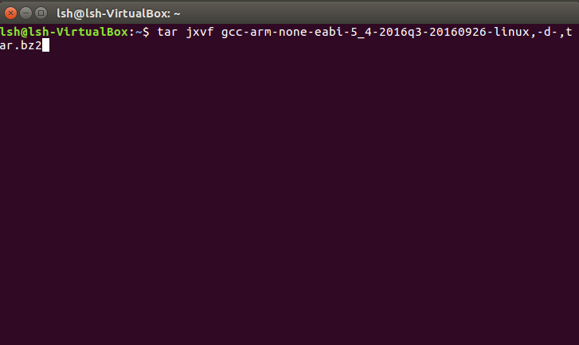

# 命令行的C语言交叉编译器-Ubuntu
## 要求
如何在Ubuntu上安装配置编译成在STM32F103上运行的程序的交叉编译器
## 方法
1. 在[https://developer.arm.com/open-source/gnu-toolchain/gnu-rm/downloads](https://developer.arm.com/open-source/gnu-toolchain/gnu-rm/downloads) 上下载最新的gcc-arm-none-eabi工具（注意32位的Linux平台最新版只到2016年9月份，需要往下翻一翻）
2. 解压下载下来的jar.bz2

3. 将解压出的目录下的bin目录添加到环境变量,编辑.bashrc
```shell
gedit ~/.bashrc
```
 在最后一行添加
 ```shell
  export PATH=$PATH:/home/lsh/gcc-arm-none-eabi-5_4-2016q3/bin
 ```
 具体路径根据解压路径修改
4. 下载[测试代码](https://github.com/zucsebd2018/CortexM-Tools/tree/master/testcode)
5. make 生成hex文件

6. 烧录程序，（因为我是在虚拟机下操作的，不方便连接串口，为了验证编译成功，我将编译生成的hex文件共享到windows上，在windows上用flymcu烧录）

7. 去掉rst和dtr线之后，用串口调试工具测试，发现出现预期的echo效果，说明hex文件正确，也说明了Ubuntu下配置的交叉编译器正确
