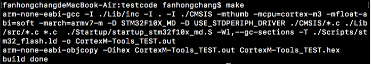

# 命令行的C语言交叉编译器-Mac OS
## 编译器下载

Cortex-M属于ARM架构，GNU项目中有支持Arm Cortex-M0, Cortex-M0+, Cortex-M3, Cortex-M4, Cortex-M7, Cortex-M23, Cortex-M33, Cortex-R4, Cortex-R5, Cortex-R7 and Cortex-R8系列的对应编译器。

最新版的编译器可以在ARM开发者网站[https://developer.arm.com/open-source/gnu-toolchain/gnu-rm](https://developer.arm.com/open-source/gnu-toolchain/gnu-rm)找到。经过尝试发现，该网站可以直接打开，但下载需要科学上网。

国内可直接下载的站点是[https://launchpad.net/gcc-arm-embedded/+download](https://launchpad.net/gcc-arm-embedded/+download)，这里的编译器版本不是最新的，但是也可以使用。

下载时注意选择MacOS版本的编译器

## 配置路径
以我下载的2016q3版本为例:

1. 下载后得到的压缩包解压后得到一个名为`gcc-arm-none-eabi-5_4-2016q3`的文件夹（文件夹中的`bin`目录中即是编译器的二进制可执行文件，接下来将这个`bin`目录加入`PATH`环境变量即可）

2. 在终端中进入用户主目录，编辑主目录下的隐藏文件`.bash_profile`(对应bash终端），在其中加入`export PATH=${PATH}:[存放编译器的目录]/gcc-arm-none-eabi-5_4-2016q3/bin` 然后重启终端

  其他修改`PATH`变量的方式也可以，只要将该`bin`目录加入`PATH`变量即可
  
这样编译器就可以在`make`时被自动调用了

## 进行编译
将github上的测试代码clone下来后，终端`cd`进入该文件夹执行`make`命令即可完成编译。

