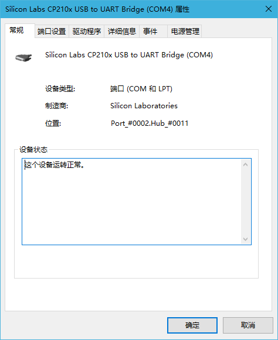

# 命令行的串口下载工具-Windows

## Prerequsites

None, Windows will automatically detect and install the driver for CP2102 UART

## Connect the CP2102 to STM32

### Inter-Connection

* RXD -> TX (Pin A9)
* TXD -> RX (Pin A10)
* VCC -> 3.3V (Bottom Right one)
* GND -> GND (Upper Left one)    **Really Important!!!**
* DTR -> RST
* RTS -> Boot0

### Intra-Connection

* Boot1 Jumper -> 0

## Download the .hex program

### Usage

#### General Usage

`stm32flash -w <hex_file> -b <baud_rate> -v -g <start address> -R -i <GPIO_String> <tty_device>`

##### Example

`stm32flash -w Code\CortexM-Tools\testcode\CortexM-Tools_TEST.hex -b 115200 -v -g 0x0 -R -i -dtr,dtr,-dtr:rts,-rts COM4`

Remark: 
* `<tty_device>` could vary on different systems, on my Windows, it is `COM4`
* In the example, baud rate 115200 is used
* After the download, the chip will start to execute at address `0x0`
* GPIO_String `-dtr,dtr,-dtr:rts,-rts` means DTR Pin triggers a RST signal and set the RTS Pin low after the download
* Verify is enabled after download by using the `-v` parameter

#### Options

 <table>
   <tr>
     <td> -b baudRate </td>
     <td> Specify baud rate </td>
   </tr>
   <tr>
     <td> -m mode </td>
     <td> Specify the format of UART data. <mode>  is a three characters long string where each character specifies, in this strict order, character size, parity and stop bits </td>
   <tr>
     <td> -w filename </td>
     <td> Specify the file to write into STM32 </td>
   </tr>
   <tr>
     <td> -g address </td>
     <td> Specify address to start execution from (0 = flash start) </td>
   </tr>
   <tr>
     <td> −i GPIO_string </td>
     <td> Specify the GPIO sequences on the host to force STM32 to enter and exit bootloader mode (See below for further explanation) </td>
   </tr>
   <tr>
     <td> -R </td>
     <td> Specify to reset the device at exit </td>
   </tr>
 </table>

#### GPIO String

In general, the format of GPIO_string is:
* GPIO_string = [entry sequence][:[exit sequence]]
* sequence = [−]x[,sequence]

In the sequence, a negative number before `x` means that the signal is at low level while the positive means high level. "rts", "dtr" and "brk" can be used to specify the pins on the USB UART.

Note that the exit sequence is only executed if -R is specified. If -R is specified, but no exit sequence, a soft-
ware-triggered reset will be performed.

As an example, before we flash the STM32, `RST` signal is needed and the `Boot0` should be set to 0 after the flash. Suppose we connect the `RTS` to `Boot0` and `DTR` to `RST`, and the GPIO String should be `-dtr,dtr,-dtr:rts,-rts`.

## Example Workflow

### Find the USB Terminal

### Download the .hex file

