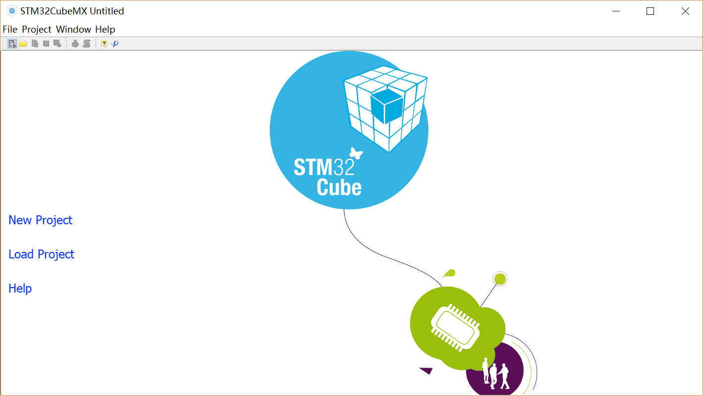
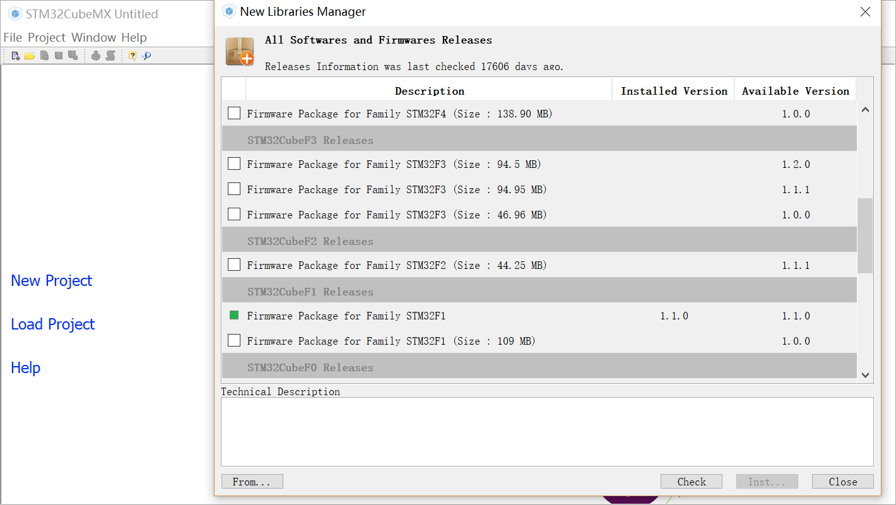
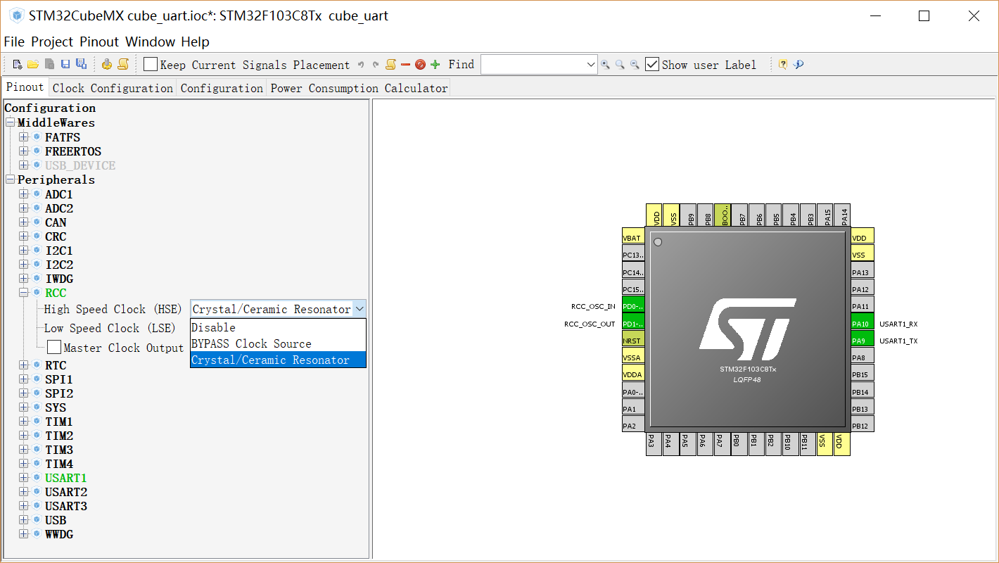
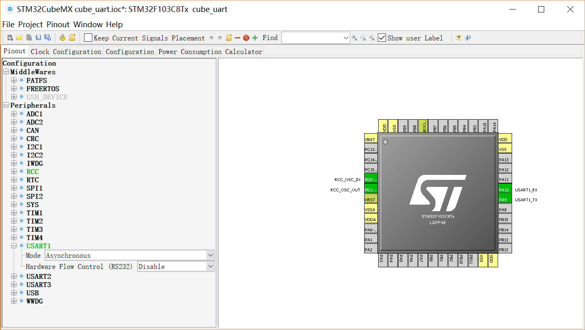
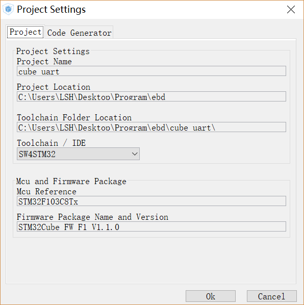
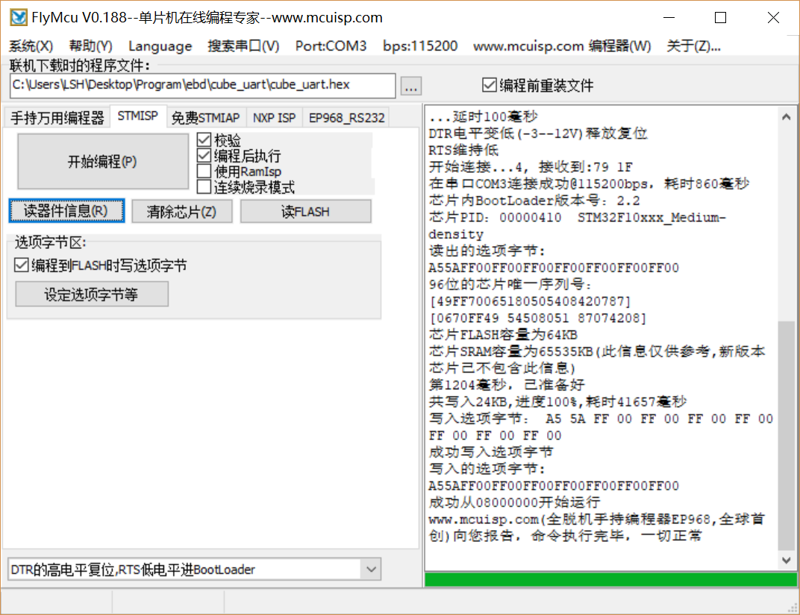
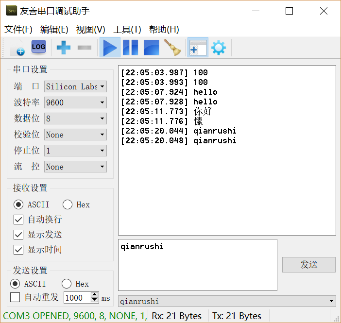

# Cube的echo程序
>用CubeMX配置一个echo程序，能初始化第一个串口，将串口收到的内容回复回去。
用W1配置的GNU交叉编译器编译，用W1配置的串口下载工具下载运行测试。
报告给出配置、编译、下载和运行的过程，并对CubeMX自动生成的代码做分析。

## 配置
### cubemx
在[官网](http://www.st.com/en/development-tools/stm32cubemx.html)下载CubeMX(需要注册账号），正常安装。打开CubeMX看到下面的界面



点击help->install new library，安装对应的库，对于我们这块芯片选择STM32F1-1.1.0即可



点击new project，选择我们的芯片型号


然后开始配置我们的项目，首先配置时钟系统，点击RCC->HSE->Crystal，配置外部高速时钟



然后配置一个串口，点击uart->asynchronous



在第三个标签页配置串口参数, 我这里选择了9600的波特率，其余默认即可


最后在project菜单下，选择setting，设置项目的目录，工具链选择SW4STM32，（因为cubemx支持生成各种IDE的项目文件，SW4STM32对gcc比较友好），最后再点击project菜单下的generator code即可在设置目录下生成相应的工程



### echo程序
在生成的项目文件夹的src文件夹下，可以看到main.c文件。在main.c中用户代码区域（注释有提示）编写echo代码。我这里采用了最简单的轮询的方式
```c
  /* USER CODE BEGIN WHILE */
  while (1)
  {
  /* USER CODE END WHILE */

  /* USER CODE BEGIN 3 */
  	HAL_UART_Receive(&huart1, &pdata, 1, 0xFFFF);
  	while(pdata!='\n'){//收到回车结束
  		HAL_UART_Transmit(&huart1,&pdata,1,0xFFFF); //接受一个字符
  		HAL_UART_Receive(&huart1,&pdata,1,0xFFFF);//发送一个字符
  	}
  	pdata = '\n';
  	HAL_UART_Transmit(&huart1,&pdata,1,0xFFFF);//发送回车
  }
  /* USER CODE END 3 */
```
HAL_UART_Receive 和 HAL_UART_Transmit 是库函数，在stm32f1xx_hal_uart.h中声明。第一个参数是串口结构体指针，第二个参数是数据缓冲区指针，第三个参数是接受或者发送的字节数，第四个参数是超时设置
我们还需要定义一个pdata变量，用于缓冲数据，可以在mian.c前面定义
```c
/* Private variables ---------------------------------------------------------*/

/* USER CODE BEGIN PV */
/* Private variables ---------------------------------------------------------*/
uint8_t pdata;
/* USER CODE END PV */

```

## 编译
为了在命令行下使用gcc编译，我们需要编写makefile，我照着之前助教的testcode里面的makefile改写了一份
```makefile
# 生成的文件名<
PROJECT                  = cube_uart

# 定义文件格式和文件名
TARGET                  := $(PROJECT)
TARGET_OUT              := $(TARGET).out
TARGET_HEX              := $(TARGET).hex
OBJCPFLAGS_ELF_TO_HEX    = -Oihex

# 定义路径
TOP_DIR      = .
SCRIPT_DIR  := $(TOP_DIR)/SW4STM32/"$(PROJECT) Configuration"
STARTUP_DIR := $(TOP_DIR)/Drivers/CMSIS/Device/ST/STM32F1xx/Source/Templates/gcc
INC_DIR     := -I $(TOP_DIR)/Drivers/STM32F1xx_HAL_Driver/Inc -I $(TOP_DIR)/Drivers/CMSIS/Include \
 -I $(TOP_DIR)/Drivers/CMSIS/Device/ST/STM32F1xx/Include -I $(TOP_DIR)/Inc

# 设置shell环境变量
#export LD_LIBRARY_PATH = $LD_LIBRARY_PATH:/Users/ch-yanghl/gcc-arm-none-eabi/arm-none-eabi/lib/thumb/

# 设置ld链接脚本文件
LDSCRIPT    := $(SCRIPT_DIR)/STM32F103C8Tx_FLASH.ld

# 定义编译工具
CC          = arm-none-eabi-gcc
OBJCP       = arm-none-eabi-objcopy

# .c文件
CCFILE      := ./Src/*.c ./Drivers/CMSIS/Device/ST/STM32F1xx/Source/Templates/*.c ./Drivers/STM32F1xx_HAL_Driver/Src/*.c

# 定义编译标志
CCFLAGS     += -mthumb -mcpu=cortex-m3 -mfloat-abi=soft -march=armv7-m

# .c文件编译时定义宏
CCFLAGS     += -D STM32F103XB -D USE_STDPERIPH_DRIVER

# 添加启动文件
SOURCE_ASM      += $(STARTUP_DIR)/startup_stm32f103xb.s

# 替换文件后缀
C_OBJS      := $(SOURCE:%.c=%.o)
ASM_OBJS    := $(SOURCE_ASM:%.s=%.o)

# 编译命令的定义
COMPILE     = $(CC) $(INC_DIR) $(CCFLAGS) $(CCFILE) $(SOURCE_ASM) -Wl,--gc-sections -T $(LDSCRIPT) -o $@ 
ELF_TO_HEX  = $(OBJCP) $(OBJCPFLAGS_ELF_TO_HEX) $(TARGET_OUT) $@

#COMPILE        = arm-none-eabi-gcc -I ./Lib/inc -I . -I ./CMSIS -mthumb -mcpu=cortex-m3 -mfloat-abi=soft -march=armv7-m -D STM32F10X_MD -D USE_STDPERIPH_DRIVER ./CMSIS/*.c ./Lib/src/*.c *.c ./Startup/startup_stm32f10x_md.S -Wl,--gc-sections -T ./Scripts/stm32_flash.ld -o $(TARGET_OUT) 
#ELF_TO_HEX     = arm-none-eabi-objcopy -Oihex $(TARGET_OUT) $(TARGET_HEX)
# 定义伪目标
.PHONY: all clean printf

# 定义规则
all: $(TARGET_HEX)
	@echo "build done"

$(TARGET_HEX): $(TARGET_OUT)
	$(ELF_TO_HEX)

$(TARGET_OUT): $(CCFILE) $(SOURCE_ASM)                                                                                              
	$(COMPILE)

# 清理项
clean:
	rm -f $(TARGET_HEX)
	rm -f $(TARGET_OUT)
	rm -f $(C_OBJS)
	@echo "clean done"
```
**为了编译成功，我们还需要修改一个头文件，stm32f1xx.h中，选择我们的芯片型号，取消注释，这样才能编译适配这块芯片的库**
```c
#if !defined (STM32F100xB) && !defined (STM32F100xE) && !defined (STM32F101x6) && \
    !defined (STM32F101xB) && !defined (STM32F101xE) && !defined (STM32F101xG) && !defined (STM32F102x6) && !defined (STM32F102xB) && !defined (STM32F103x6) && \
    !defined (STM32F103xB) && !defined (STM32F103xE) && !defined (STM32F103xG) && !defined (STM32F105xC) && !defined (STM32F107xC)
  /* #define STM32F100xB  */   /*!< STM32F100C4, STM32F100R4, STM32F100C6, STM32F100R6, STM32F100C8, STM32F100R8, STM32F100V8, STM32F100CB, STM32F100RB and STM32F100VB */
  /* #define STM32F100xE */    /*!< STM32F100RC, STM32F100VC, STM32F100ZC, STM32F100RD, STM32F100VD, STM32F100ZD, STM32F100RE, STM32F100VE and STM32F100ZE */
  /* #define STM32F101x6  */   /*!< STM32F101C4, STM32F101R4, STM32F101T4, STM32F101C6, STM32F101R6 and STM32F101T6 Devices */
  /* #define STM32F101xB  */   /*!< STM32F101C8, STM32F101R8, STM32F101T8, STM32F101V8, STM32F101CB, STM32F101RB, STM32F101TB and STM32F101VB */
  /* #define STM32F101xE */    /*!< STM32F101RC, STM32F101VC, STM32F101ZC, STM32F101RD, STM32F101VD, STM32F101ZD, STM32F101RE, STM32F101VE and STM32F101ZE */ 
  /* #define STM32F101xG  */   /*!< STM32F101RF, STM32F101VF, STM32F101ZF, STM32F101RG, STM32F101VG and STM32F101ZG */
  /* #define STM32F102x6 */    /*!< STM32F102C4, STM32F102R4, STM32F102C6 and STM32F102R6 */
  /* #define STM32F102xB  */   /*!< STM32F102C8, STM32F102R8, STM32F102CB and STM32F102RB */
  /* #define STM32F103x6  */   /*!< STM32F103C4, STM32F103R4, STM32F103T4, STM32F103C6, STM32F103R6 and STM32F103T6 */
   #define STM32F103xB     /*!< STM32F103C8, STM32F103R8, STM32F103T8, STM32F103V8, STM32F103CB, STM32F103RB, STM32F103TB and STM32F103VB */
  /* #define STM32F103xE */    /*!< STM32F103RC, STM32F103VC, STM32F103ZC, STM32F103RD, STM32F103VD, STM32F103ZD, STM32F103RE, STM32F103VE and STM32F103ZE */
  /* #define STM32F103xG  */   /*!< STM32F103RF, STM32F103VF, STM32F103ZF, STM32F103RG, STM32F103VG and STM32F103ZG */
  /* #define STM32F105xC */    /*!< STM32F105R8, STM32F105V8, STM32F105RB, STM32F105VB, STM32F105RC and STM32F105VC */
  /* #define STM32F107xC  */   /*!< STM32F107RB, STM32F107VB, STM32F107RC and STM32F107VC */  
#endif
```

最后在命令行下make即可


## 下载
使用flymcu烧录，配置参考w1



## 运行
使用串口调试工具，发送消息，发现回复了一模一样的消息(中文肯定是有问题的），说明echo程序正常运行



## 自动生成代码分析
生成的项目目录下有四个目录Drivers,Inc,Src,SW4STM32，和cubemx的配置文件。
### SW4STM32
这个目录下是SW4STM32 IDE的配置文件，有用的是STM32F103C8Tx_FLASH.ld，这个文件是编译时候要用的链接脚本文件

### Drive
这个目录下是完整的STM32的固件库代码

### Src 和 Inc
这个目录下就是由CubeMX为我们自动生成的代码，可以看到只有main HAL初始化等必要程序，以及我们设置串口需要的uart.c 和 gpio.c。

简单的看下这几个文件，首先main.c 里面有很多注释，哪里是变量定义，哪里是用户代码段，应该是为了保证执行顺序。
```c
int main(void)
{

  /* USER CODE BEGIN 1 */

  /* USER CODE END 1 */

  /* MCU Configuration----------------------------------------------------------*/

  /* Reset of all peripherals, Initializes the Flash interface and the Systick. */
  HAL_Init();

  /* Configure the system clock */
  SystemClock_Config();

  /* Initialize all configured peripherals */
  MX_GPIO_Init();
  MX_USART1_UART_Init();

  /* USER CODE BEGIN 2 */

  /* USER CODE END 2 */

  /* Infinite loop */
  /* USER CODE BEGIN WHILE */
  while (1)
  {
  /* USER CODE END WHILE */

  /* USER CODE BEGIN 3 */
  	HAL_UART_Receive(&huart1, &pdata, 1, 0xFFFF);
  	while(pdata!='\n'){
  		HAL_UART_Transmit(&huart1,&pdata,1,0xFFFF);
  		HAL_UART_Receive(&huart1,&pdata,1,0xFFFF);
  	}
  	pdata = '\n';
  	HAL_UART_Transmit(&huart1,&pdata,1,0xFFFF);
  }
  /* USER CODE END 3 */

}
```

main 函数里面首先初始化了HAL，然后配置了系统时钟，这个配置函数是根据我们在cubemx里面的设置生成的，然后初始化GPIO，再初始化串口。然后无限循环，执行我们编写的功能代码。

再看下uart.c 这个文件里面的代码主要也是配置，将我们之前配置的串口参数，比如波特率，数据位，赋给固件库中的串口结构体。还有GPIO绑定，A9 A10 为RX和TX

头文件中的stm32f1xx_hal_conf.h 就是一个选择库配置文件。
```c
#define HAL_MODULE_ENABLED  
//#define HAL_ADC_MODULE_ENABLED   
//#define HAL_CAN_MODULE_ENABLED   
//#define HAL_CEC_MODULE_ENABLED   
//#define HAL_CORTEX_MODULE_ENABLED   
//#define HAL_CRC_MODULE_ENABLED   
//#define HAL_DAC_MODULE_ENABLED   
//#define HAL_DMA_MODULE_ENABLED   
//#define HAL_ETH_MODULE_ENABLED   
//#define HAL_FLASH_MODULE_ENABLED   
#define HAL_GPIO_MODULE_ENABLED
//#define HAL_I2C_MODULE_ENABLED   
//#define HAL_I2S_MODULE_ENABLED   
//#define HAL_IRDA_MODULE_ENABLED   
//#define HAL_IWDG_MODULE_ENABLED   
//#define HAL_NOR_MODULE_ENABLED   
//#define HAL_NAND_MODULE_ENABLED   
//#define HAL_PCCARD_MODULE_ENABLED   
//#define HAL_PCD_MODULE_ENABLED   
//#define HAL_HCD_MODULE_ENABLED   
//#define HAL_PWR_MODULE_ENABLED   
//#define HAL_RCC_MODULE_ENABLED   
//#define HAL_RTC_MODULE_ENABLED   
//#define HAL_SD_MODULE_ENABLED   
//#define HAL_SDRAM_MODULE_ENABLED   
//#define HAL_SMARTCARD_MODULE_ENABLED   
//#define HAL_SPI_MODULE_ENABLED   
//#define HAL_SRAM_MODULE_ENABLED   
//#define HAL_TIM_MODULE_ENABLED   
#define HAL_UART_MODULE_ENABLED
//#define HAL_USART_MODULE_ENABLED   
//#define HAL_WWDG_MODULE_ENABLED   
```

可以看到里面就我们配置的UART和GPIO的宏定义被取消了注释，下面则是一些条件编译的预处理命令。 应该是只选择编译连接需要的库函数，减小生成的hex文件体积

其余的文件应该是和HAL的初始化有关。