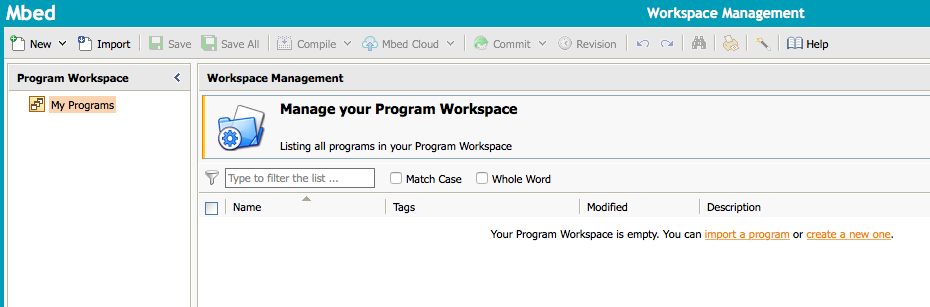
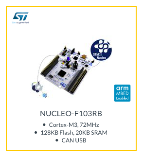
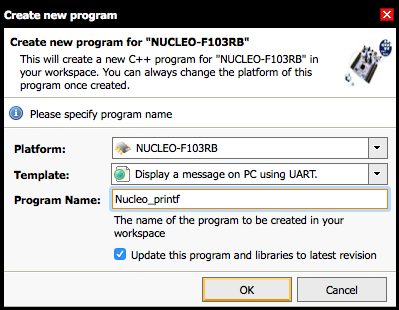
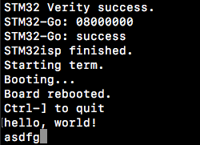

# Build an echo program using Mbed
## What is Mbed
Arm Mbed is the idea that the Internet of Things (IoT) is a collaboration between the people who make things, the people who use things and the people who make the services all these things use. Arm created a solution to help lead sustainable growth within the IoT and named it Mbed.

## Prerequisites

* Being able to connect your STM32F103C8T6 board to your computer
* GNU compile tool chain for Arm Cortex-M
* Serial tool for loading the program into the board's Flash memory

You may read the correspoding tutorials in our github to deal with these. 

## Create a project
Mbed provides an [online compiler](https://os.mbed.com/compiler/) which offers a full programming environment designed to work with Mbed APIs and boards.



To use this compiler for STM32F103C8T6, we need to sign up and [add the board](https://os.mbed.com/platforms/) NUCLEO-F103RB(having the same CPU as STM32F103C8T6) into the compiler.




After that, create a new project in the online compiler:



Then we get a sample project for NUCLEO-F103RB, it is not build for STM32F103C8T6, don't be worry.

Using "Import Wizard" to import "mbed-STM32F103C8T6" library, we can make it fit into our board.


After the library being imported, don't forget to add `#include <stm32f103c8t6.h>` before `#include <mbed.h>`

Then we can begin to write our echo program, I have written a simple one:

```
#include "stm32f103c8t6.h"
#include "mbed.h"

//------------------------------------
// Hyperterminal configuration
// 9600 bauds, 8-bit data, no parity
//------------------------------------

Serial pc(PA_9, PA_10);

DigitalOut myled(LED1);

void echo()
{
    pc.printf("%c",pc.getc());
}

int main()
{
    pc.attach(&echo);
    while(1) {
        wait(1);
        myled = !myled;
    }
}

```
It is worth mentioning that the sample given by Mbed use `SERIAL_TX, SERIAL_RX` port as the serial port, we have to change them into `PA_9, PA_10` in order not to change our port settings.
## Export the project
We can build the project online, while it only gives you a `.bin` file, and its coding environment isn't comfortable and convinient for our later works. Fortunately we can export the project to our computer.


Choose the tool chain option `GCC (ARM Embedded)`, and click `Export` 

Unzip the downloaded package and `cd` into it. We can see that it uses makefile to construct the project.

I wrote a simple shell script to automatically build the project, flash it into the board and run it.

```
#!/bin/bash
make
stm32isp ./BUILD/Nucleo_printf.hex  /dev/tty.SLAB_USBtoUART 115200 -reset DTR -bootp -RTS -term 9600
```
## Build, Flash it and Run
Run the script.




We can see that this program works well!


