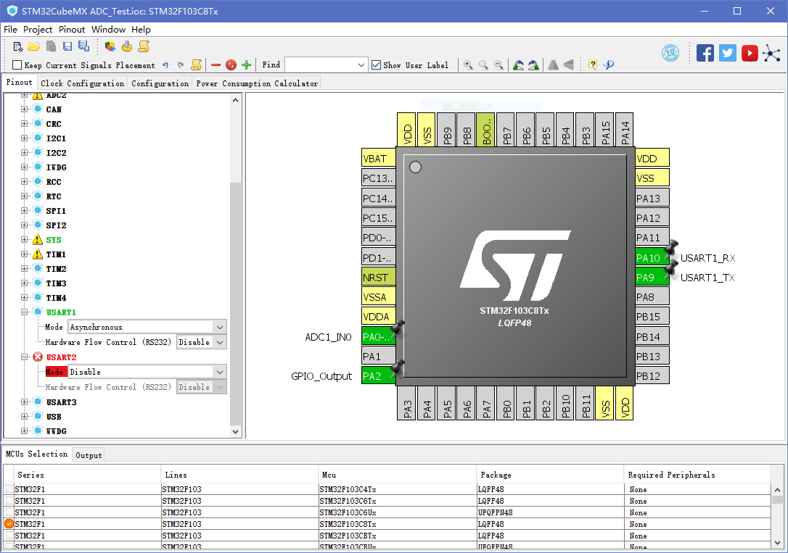
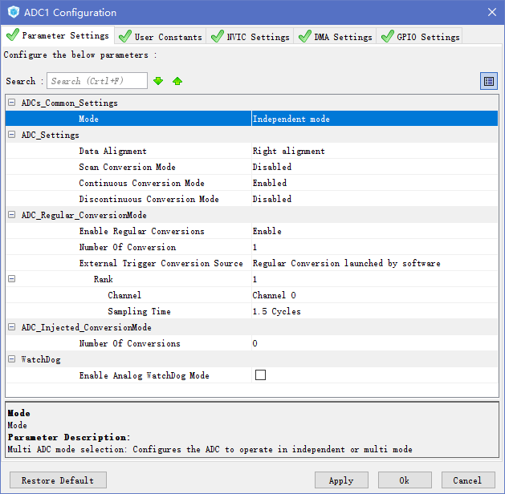
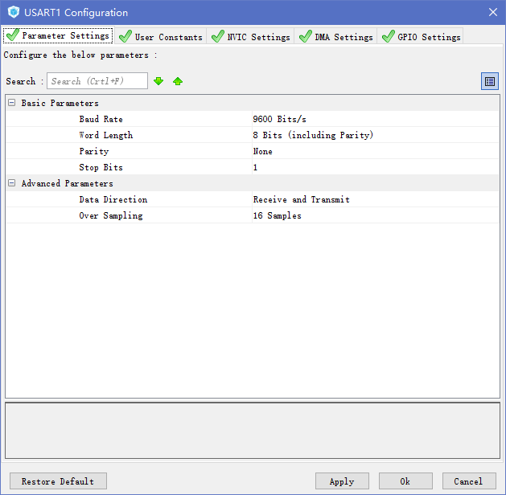

# STM32 CubeMX Basic ADC Usage

## Preface

In this tutorial, we will set up a simple voltmeter using the STM32 internal ADC with polling mode. The internal ADC has a resolution of 12-bit, which means that voltage between the `Vref-` and `Vref+` will be sampled to a value between `0` and `4095`.

## Prerequsites

* STM32CubeMX with STM32F1 library
* A Potentiometer, used to divide the voltage

## Pin Connections

### CP2101 to STM32
* RXD -> TX (Pin A9)
* TXD -> RX (Pin A10)
* VCC -> 3.3V
* GND -> GND 
* DTR -> RST
* RTS -> Boot0

### STM32 Jumper
* Boot1 Jumper -> 0

### LED and Potentiometer

*  A2 -> LED negative
*  A0 -> Potentiometer Vout
* VCC -> Potentiometer Vcc
* GND -> Potentiometer GND

## STM32CubeMX Configuration

### Create a `STM32F103C8Tx` project

Same as before, no elaboration here.

### Pin Configurations



*  PA0: ADC1_IN0
*  PA2: GPOP_Output (LED)
*  PA9: USART_TX
* PA10: USART_RX

### ADC Configurations



Set `ADC1 Continuous Conversion Mode` to `Enabled`, which means that the ADC will continuously read the voltage level fed to the input pin, or it will only read once.

### USART Configurations



The serial port is used to transmit the data we get back to PC, so USART needed to be configured here. Change the values to the ones that you like.

### Generate the Code

Same as before.

### Modify the `Makefile` to support float point output

Since the voltage is never an integer, we need to be able to print float point number in STM32. Unfortunately, it is not enabled by default.

Follow the instruction to enable the float point:
1. In the `Makefile` generated by CubeMX, search for the following comment/line:
```Makefile
# float-abi
```
... and add the following line bellow it:
```Makefile
FLOAT-ABI = -mfloat-abi=soft
```
2. Go down in the file until you find the `LDFLAGS` variable and edit the line by inserting the following string (maybe just after `$(LIBS)` ):
```Makefile
-u _printf_float
```

Now the float point output should work in your code.

## ADC workflow (Polling mode)

Basically, the ADC in STM32 should be operated in this way:

1. Perform an automatic ADC calibration using the function `HAL_ADCEx_Calibration_Start()`
2. Activate the ADC peripheral and start conversions using function `HAL_ADC_Start()`
3. Wait for ADC conversion completion using function `HAL_ADC_PollForConversion()`
4. Retrieve conversion results using function `HAL_ADC_GetValue()`
5. Stop conversion and disable the ADC peripheral using function `HAL_ADC_Stop()`

**Remark**

```C
HAL_StatusTypeDef HAL_ADCEx_Calibration_Start (ADC_HandleTypeDef * hadc)
```
* Function description: Perform an ADC automatic self-calibration Calibration 
  * prerequisite: ADC must be disabled (execute this function before `HAL_ADC_Start()` or after `HAL_ADC_Stop()` ).
* Parameters: 
  * hadc: ADC handle
* Return values: 
  * HAL: status

```C
HAL_StatusTypeDef HAL_ADC_Start(ADC_HandleTypeDef *hadc)
```
* Function description: Enables ADC, starts conversion of regular group.
* Parameters: 
  * hadc: ADC handle
* Return values:
  * HAL: status

```C
HAL_StatusTypeDef HAL_ADC_Stop(ADC_HandleTypeDef *hadc)
```
* Function description: Stop ADC conversion of regular group (and injected channels in case of auto_injection mode), disable ADC peripheral.
* Parameters:
  * hadc: ADC handle
* Return values: 
  * HAL: status.

```C
HAL_StatusTypeDef HAL_ADC_PollForConversion(ADC_HandleTypeDef * hadc, uint32_t Timeout)
```
* Function description Wait for regular group conversion to be completed.
* Parameters:
  * hadc: ADC handle
  * Timeout: Timeout value in millisecond.
* Return values:
  * HAL: status

```C
uint32_t HAL_ADC_GetValue(ADC_HandleTypeDef * hadc)
```
* Function description: Get ADC regular group conversion result.
* Parameters: 
  * hadc: ADC handle
* Return values: 
  * ADC: group regular conversion data

## Code snippet

```C
  /* USER CODE BEGIN 2 */
  HAL_GPIO_WritePin(GPIOA,GPIO_PIN_2,GPIO_PIN_RESET);
  HAL_ADCEx_Calibration_Start(&hadc1);
  
  uint32_t adc1_value;
  float adc1_v;
  char buf[100];
  /* USER CODE END 2 */

  /* Infinite loop */
  /* USER CODE BEGIN WHILE */
  HAL_ADC_Start(&hadc1);
  while (1)
  {

  /* USER CODE END WHILE */

  /* USER CODE BEGIN 3 */
   HAL_GPIO_WritePin(GPIOA,GPIO_PIN_2,GPIO_PIN_RESET);
   
   HAL_ADC_PollForConversion(&hadc1, 100);
   adc1_value = HAL_ADC_GetValue(&hadc1);
   adc1_v = (float)adc1_value / 4095 * 3.3;
   sprintf(buf, "Current Voltage is: %.2f\n", adc1_v);
   HAL_UART_Transmit(&huart1, (uint8_t*)buf, strlen(buf), 0xFFFF);
   
   HAL_Delay(100);
   HAL_GPIO_WritePin(GPIOA,GPIO_PIN_2,GPIO_PIN_SET);
   HAL_Delay(400);
  }
  HAL_ADC_Stop(&hadc1);
  /* USER CODE END 3 */
```

