# 测试实例

## 串口初始化测试

在上周的实现Echo功能时，main.c函数中就有uart初始化的相关函数：
```C
static void MX_USART1_UART_Init(void)
{

  huart1.Instance = USART1;
  huart1.Init.BaudRate = 9600;
  huart1.Init.WordLength = UART_WORDLENGTH_8B;
  huart1.Init.StopBits = UART_STOPBITS_1;
  huart1.Init.Parity = UART_PARITY_NONE;
  huart1.Init.Mode = UART_MODE_TX_RX;
  huart1.Init.HwFlowCtl = UART_HWCONTROL_NONE;
  huart1.Init.OverSampling = UART_OVERSAMPLING_16;
  if (HAL_UART_Init(&huart1) != HAL_OK)
  {
    _Error_Handler(__FILE__, __LINE__);
  }

}
```

这里我们可以尝试修改一下BaudRate试试，看一下实验的结果会有什么变化，我将BaudRate修改为115200，而minicom中的串口设置中不进行修改：

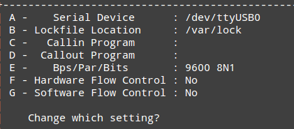

结果在串口通信时就发生了乱码的情况：

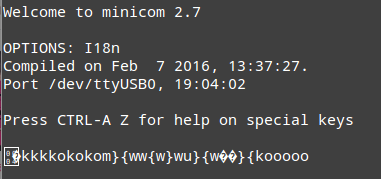

本来应该输出的"Hello World!"变成了乱码，后续的Echo也并非实际输入，因为实际波特率与minicom的设定不相符合，所以会有这样的情况。而如果将minicom的设置改为115200，则能够正常的输入和输出。

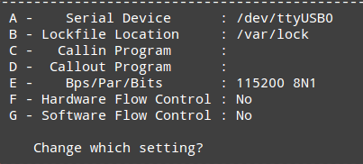

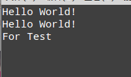

## 串口I/O

基于轮询的IO已经在上周尝试过了，可以参考，这里不多做赘述。

我这里尝试了一下中断方法。

首先我们可以在CubeMX中设置，打开UART的全局中断：

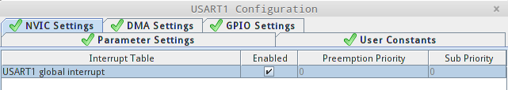

然后生成代码，我们可以在stm32f1xx_hal_uart.c中看到一段新出现的代码：

```C
void USART1_IRQHandler(void)
{
  /* USER CODE BEGIN USART1_IRQn 0 */

  /* USER CODE END USART1_IRQn 0 */
  HAL_UART_IRQHandler(&huart1);
  /* USER CODE BEGIN USART1_IRQn 1 */

  /* USER CODE END USART1_IRQn 1 */
}
```

这里用了`HAL_UART_IRQHandler(&huart1)`来实现全局中断这一功能。

对于中断机制，我这里也不是特别理解，以一个例子来说：

当使用轮询时：

```C
unsigned char i = 0;
  for (i = 0; i < 32; i++)
  {
    transmitBuffer[i] = i + 65;
    receiveBuffer[i] = 65;
  }


  while (1)
  {

  /* USER CODE END WHILE */

  /* USER CODE BEGIN 3 */
  HAL_UART_Receive(&huart1, receiveBuffer, 32, 0xffff);

  HAL_UART_Transmit(&huart1, receiveBuffer, 32, 0xffff);
  }
```

我们在发送数据时，如果长度超过32位，只有前32位会被发送过去，Echo的也只有前32位。

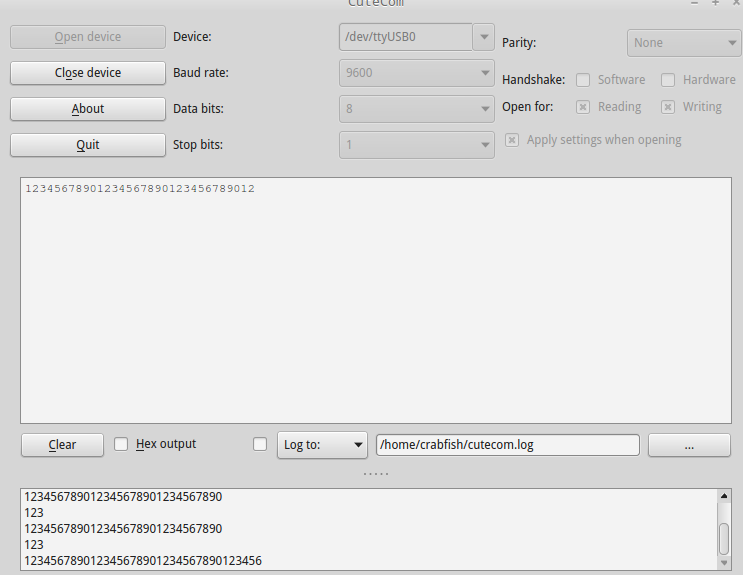

如果使用IT方式发送：

```C
  unsigned char i = 0;
  for (i = 0; i < 32; i++)
  {
    transmitBuffer[i] = i + 65;
    receiveBuffer[i] = 65;
  }


  while (1)
  {

  /* USER CODE END WHILE */

  /* USER CODE BEGIN 3 */
  HAL_UART_Receive_IT(&huart1, receiveBuffer, 32);

  HAL_UART_Transmit_IT(&huart1, receiveBuffer, 32);
  }
  /* USER CODE END 3 */

}
```

则会出现如下情况：

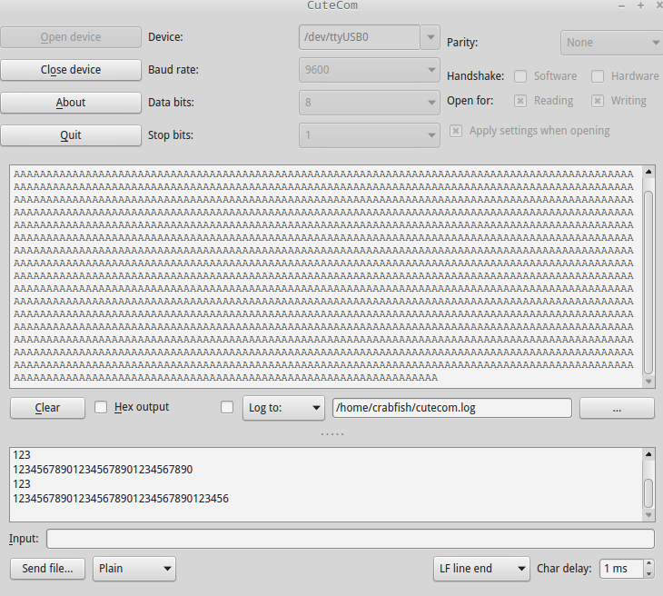

会不断发送信息，无视输入。。。

## 定时器相关

同样先在CubeMX中配置定时器，我选择了TIM2。

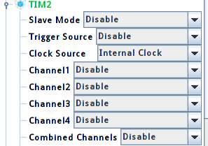

然后在Configuration中配置定时的时常，并打开中断。

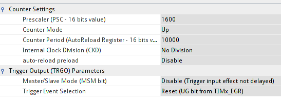

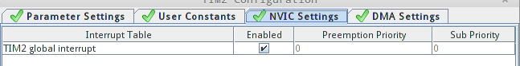

然后在main.c中编写中断函数，即每当定时器计数到预设时长时就会进入中断函数：

```C
void HAL_TIM_PeriodElapsedCallback(TIM_HandleTypeDef *htim)
{
        if (htim->Instance == htim2.Instance)
        {
            unsigned char txData[]={"in HAL_TIM_PeriodElapsedCallback\r\n"};
            HAL_UART_Transmit(&huart1,txData,sizeof(txData)-1,0xffff);
        }
}
```

即每隔一定时长，STM32就会通过串口发送一段数据。

结果如下：

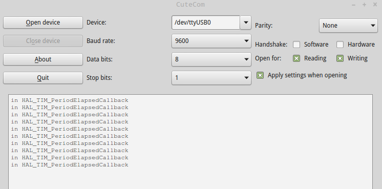