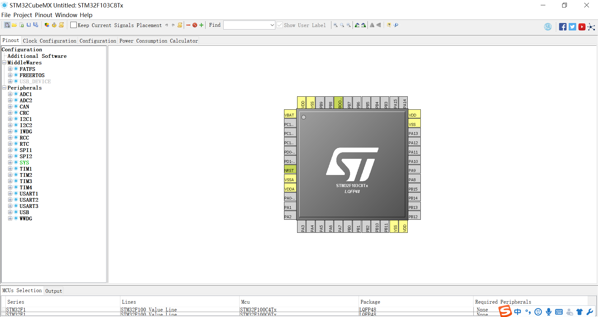
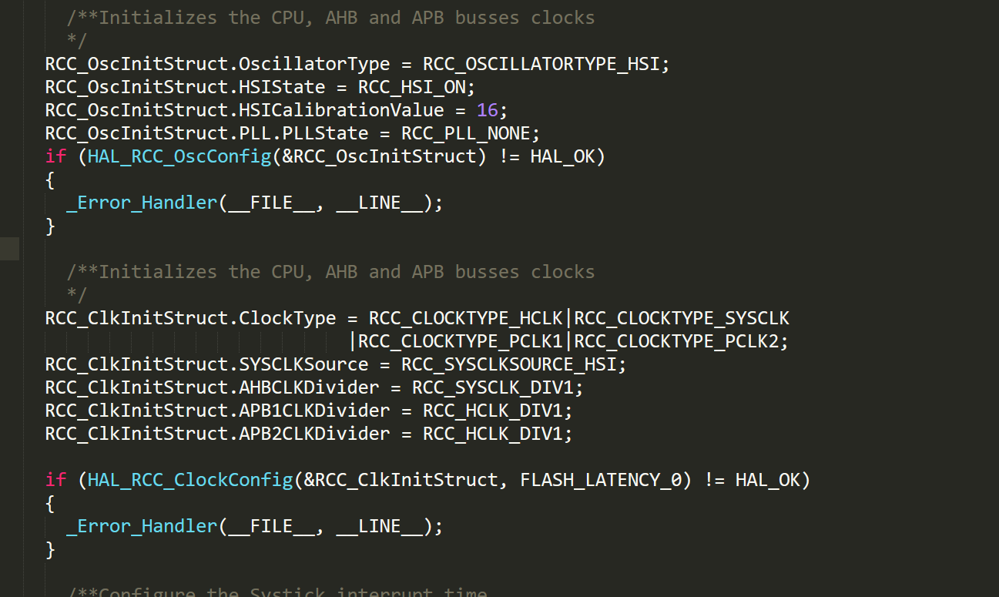
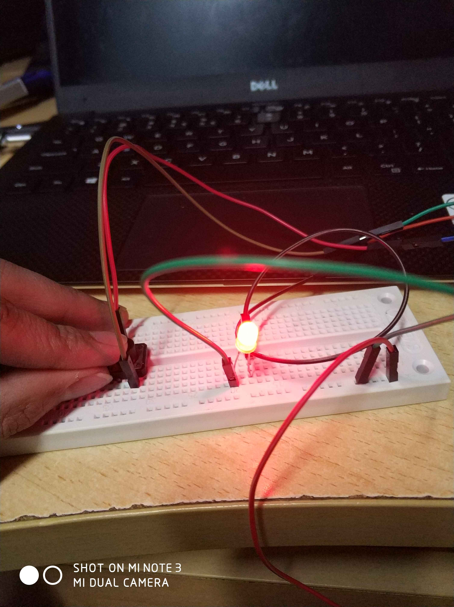

# 代码实践
## 生成一个cube空的工程


虽然是空的工程，但是打开main.c还是可以看到cube已经帮我们生成好了一部分初始化代码，包括时钟配置

## 修改系统时钟


可以看到默认的时钟是`HSI`的，我们接下来将其改成`PLL`
### 启用PLL
将 `RCC_OscInitStruct.PLL.PLLState = RCC_PLL_NONE;` 
改成`RCC_OscInitStruct.PLL.PLLState = RCC_PLL_ON;`
### 配置PLL
```c
RCC_OscInitStruct.PLL.PLLSource = RCC_PLLSOURCE_HSI_DIV2;
RCC_OscInitStruct.PLL.PLLMUL = RCC_PLL_MUL8;
```
第一句是将 PLL的时钟源设置为HSI的2分频，HSI的默认时钟是8MHz，所以PLL的源时钟是4MHz
第二句是设置PLL的倍频，RCC_PLL_MUL8是一个宏，代表8倍频，除此之外还有MUL2,3,4,5,6等，最高倍频取决于芯片本身。经过这样设置，我们得到了一个`8 / 2 * 4 = 32MHz`的时钟 
### 设置系统时钟为PLL
将`RCC_ClkInitStruct.SYSCLKSource = RCC_SYSCLKSOURCE_HSI;`
改成`RCC_ClkInitStruct.SYSCLKSource = RCC_SYSCLKSOURCE_PLLCLK;`

## 配置GPIO
```c
void LSH_GPIO_Init(void){
  __HAL_RCC_GPIOA_CLK_ENABLE();//启用GPIOA寄存器组

  GPIO_InitTypeDef GPIO_InitStruct;//构造一个GPIO初始化对象

  //配置烧录需要的串口引脚 
  GPIO_InitStruct.Pin = GPIO_PIN_9;//设置9号引脚 RX
  GPIO_InitStruct.Mode = GPIO_MODE_AF_PP;//设置引脚模式，AF_PP 复用I/O
  GPIO_InitStruct.Speed = GPIO_SPEED_FREQ_HIGH;//设置引脚速度
  HAL_GPIO_Init(GPIOA, &GPIO_InitStruct);//初始化引脚

  GPIO_InitStruct.Pin = GPIO_PIN_10;//配置10号引脚 TX
  GPIO_InitStruct.Mode = GPIO_MODE_INPUT;//引脚模式 输入
  GPIO_InitStruct.Pull = GPIO_NOPULL;//不设置引脚高低
  HAL_GPIO_Init(GPIOA, &GPIO_InitStruct);//初始化引脚

  //配置2号引脚
  GPIO_InitStruct.Pin = GPIO_PIN_2;
  GPIO_InitStruct.Mode = GPIO_MODE_OUTPUT_PP;//输出模式
  HAL_GPIO_Init(GPIOA,&GPIO_InitStruct);

  //配置3号引脚
  GPIO_InitStruct.Pin = GPIO_PIN_3;
  GPIO_InitStruct.Mode = GPIO_MODE_OUTPUT_PP;//输出模式
  HAL_GPIO_Init(GPIOA,&GPIO_InitStruct);
  
}
```

## 使用GPIO
```c
while (1)
{
/* USER CODE END WHILE */
HAL_GPIO_WritePin(GPIOA,GPIO_PIN_1,GPIO_PIN_RESET);//1常亮
HAL_GPIO_TogglePin(GPIOA, GPIO_PIN_2);//2闪烁
HAL_Delay(500);
if(HAL_GPIO_ReadPin(GPIOA,GPIO_PIN_4)==GPIO_PIN_RESET){
	HAL_GPIO_TogglePin(GPIOA, GPIO_PIN_3);//切换开关
	while(HAL_GPIO_ReadPin(GPIOA,GPIO_PIN_4)==GPIO_PIN_RESET);//等待按键释放
}
/* USER CODE BEGIN 3 */

}
```

按下按键亮灯的效果（还存在按键抖动问题）
