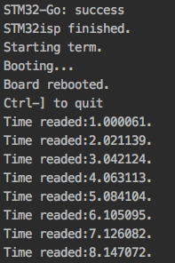
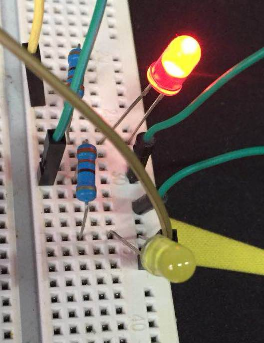
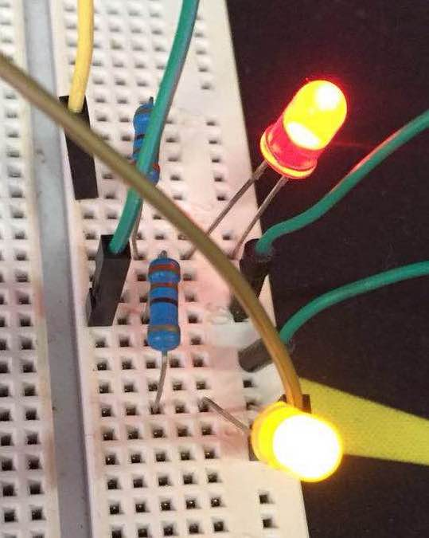

# 定时器测试

## 代码解读
>串口在这里是为了调试输出，它的使用方式不在本文范围内，本文不会详细提及

### 变量定义
一共定义了七个变量，除了串口以外，前三个是数字输出端口led1、2、3， 分别将他们绑定在了板上的LED、PA0和PA1上。

```
DigitalOut led1(LED1);
DigitalOut led2(PA_0);
DigitalOut led3(PA_1);
```
后三个分别是我们进行测试的三个类型的定时器。

```
Timeout timeout;
Ticker ticker;
Timer timer;
```
其中timeout是延时器，ticker是定时器，timer是计时器。
### 函数定义
在main函数之前定义了三个函数，其中L2和L3的行为都是将对应的GPIO输出反向，它们接下来将会被绑定到两种定时器的中断服务函数上，在对应时间被计时器中断调用。

```
void L2()
{
    led2 = !led2;
}
void L3()
{
    led3 = !led3;
}
```
### 初始化
为了展示效果，我们在一开始首先将三个LED初始化为关闭状态：

```
    led1 = 0;
    led2 = 0;
    led3 = 0;
```
然后将延时器`timeout`的中断绑定到L2函数，设置延时为5秒，这一动作将会使得单片机上电启动后经过5秒，对应LED亮起：

```
    timeout.attach(L2,5);
```
将定时器`ticker`的中断绑定到L3函数，设置时间为1秒，这将会使得单片机上电启动后对应LED每秒开/关一次：

```
    ticker.attach(L3,1);
```
将计时器`timer`打开计时：

```
    timer.start();
```
在main函数的最后我们增加一个每秒一次的死循环，使单片机保持执行,并且通过串口输出计时器`timer`中读到的时间：

```
    while(1) {
        wait(1);
        led1 = !led1;
        pc.printf("Time readed:%f.\n",timer.read());
    }
```

## 效果展示
串口的输出：



开机5秒后常亮的红色LED和闪烁的黄色LED：




## 附录：代码

```
#include "stm32f103c8t6.h"
#include "mbed.h"
//------------------------------------
// Hyperterminal configuration
// 9600 bauds, 8-bit data, no parity
//------------------------------------

Serial pc(PA_9, PA_10);

DigitalOut led1(LED1);
DigitalOut led2(PA_0);
DigitalOut led3(PA_1);

Timeout timeout;
Ticker ticker;
Timer timer;

void echo()
{
    pc.printf("%c",pc.getc());
}
void L2()
{
    led2 = !led2;
}
void L3()
{
    led3 = !led3;
}

int main()
{
    led1 = 0;
    led2 = 0;
    led3 = 0;

    pc.attach(&echo);
    timeout.attach(L2,5);
    timer.start();
    ticker.attach(L3,1);
    
    while(1) {
        wait(1);
        led1 = !led1;
        pc.printf("Time readed:%f.\n",timer.read());
    }
}
```