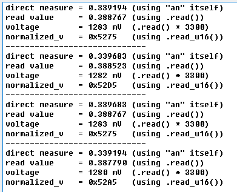
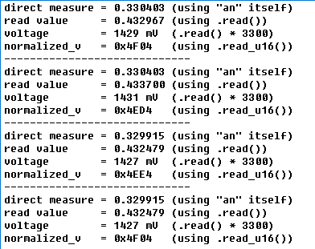

# mbed的ADC配置和使用

### ADC简介

ADC是**Analog-to-digital converter**的简称，用于将模拟信号转换为离散信号。在此实验中会转换成电压信号，从而可以应用于读取某些传感器数值的场合。


### 定义

`AnalogIn an(ADC_VREF);`

此代码段把`ADC_VREF`口作为电压读取通道，并通过调用an里的方法来获取电压信息。


### 调用方法

##### 1. float read();  

用于读取ADC的电压信息，范围为[0.0, 1.0]

##### 2. unsigned short read_u16();

用于读取ADC的标准化电压信息，类型为`unsigned short`

把浮点电压值离散化到`[0x0, 0xffff]`中

##### 3. 通过重载的float类型来读取电压信息

用`AnalogIn`类定义的实例被重载为float类型，因此可以直接用于读取，效果同`float read()`


### 尝试使用

1. 注意到开头要导入`stm32f103c8t6.h`这个库的头文件
2. 定义一个实例 `AnalogIn an(A0)`
3. 通过`meas_r`读取[0.0, 1.0]区间内的电压信息
4. 把`meas_v = meas_r * 3300`得到以mV为单位的电压信息
5. 也可以直接把`an`赋值给`direct_v`，从而读取电压
6. 结果会在串口传回来

```c
#include "stm32f103c8t6.h"
#include "mbed.h"

Serial s1(PA_9, PA_10);	
AnalogIn an(ADC_VREF);

DigitalOut led(LED1);

int main()
{
    float meas_r;
    float meas_v;
    float direct_v;
    int normalized_v;

    // From Zhifeng Jiang's doc
    s1.baud(115200);								// set baudrate
    s1.format(8, Serial::None, 1);	
    
    printf("\nAnalogIn example\n");
    int k=0;
    while(1) {

        meas_r = an.read(); // Read the analog input value (value from 0.0 to 1.0 = full ADC conversion range)
        meas_v = meas_r * 3300; // Converts value in the 0V-3.3V range
        direct_v = an;
        normalized_v = an.read_u16();
        
        // Display values
        s1.printf("direct measure = %f  (using \"an\" itself)\n", direct_v); 
        s1.printf("read value     = %f (using .read())\n", meas_r);
        s1.printf("voltage        = %.0f mV (.read() * 3300) \n", meas_v);
        s1.printf("normalized_v   = 0x%04X (using .read_u16()) \n", normalized_v);

        // LED is ON is the value is below 1V
        if (meas_v < 1000) {
            led = 0; // LED ON
        } else {
            led = 1; // LED OFF
        }
        if (k==0) k=1;
        else k=0;
        wait(1.0); // 1 second
    }
}
```


其他注意事项：

1. 在stm32f1038ct6这个板子里的LED灯，0是亮，1是暗


### 效果图

接ADC_VREF的口，效果：



接ADC_TEMP的口，效果：

