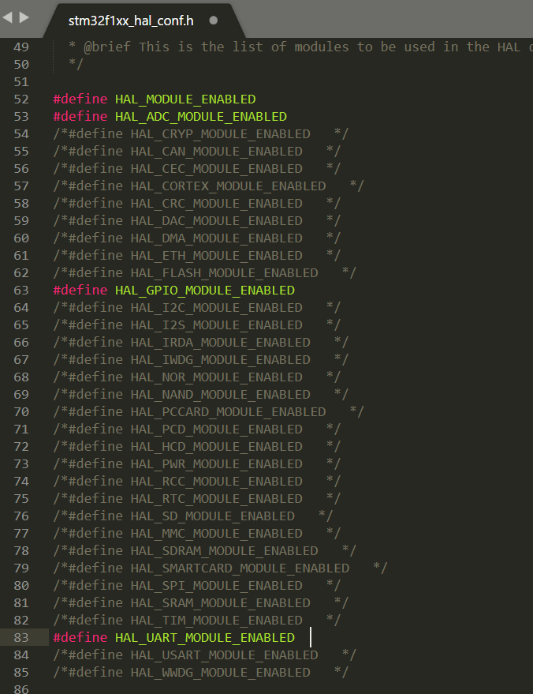
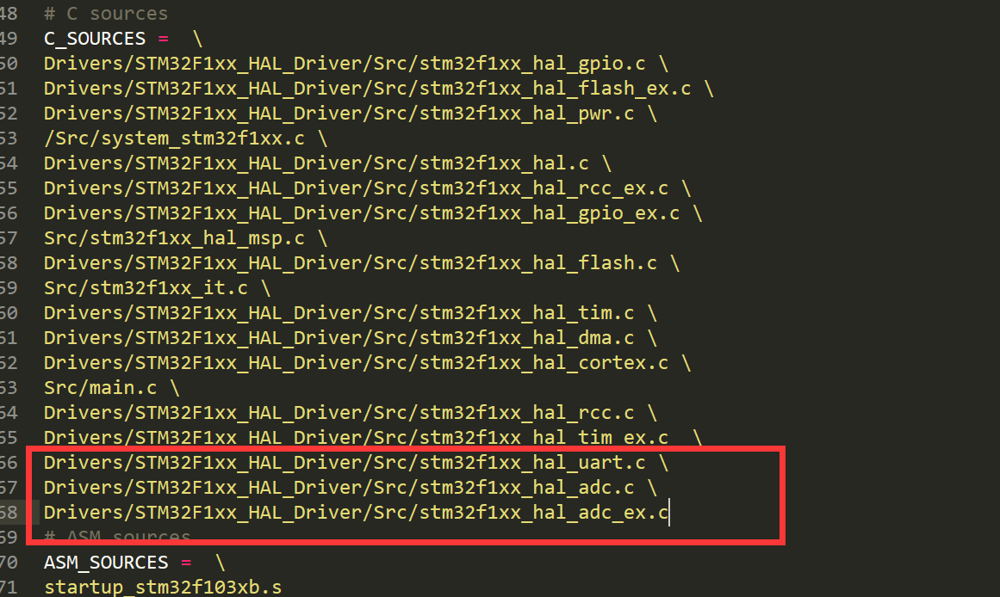
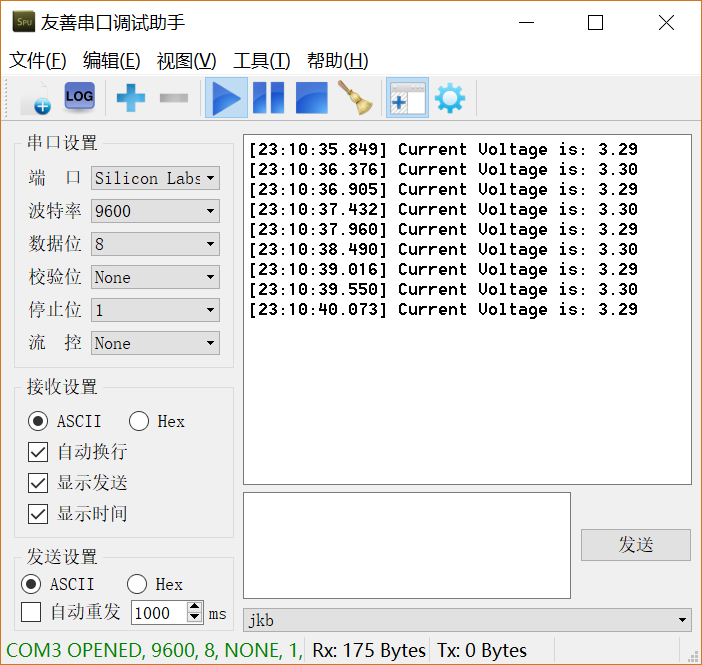
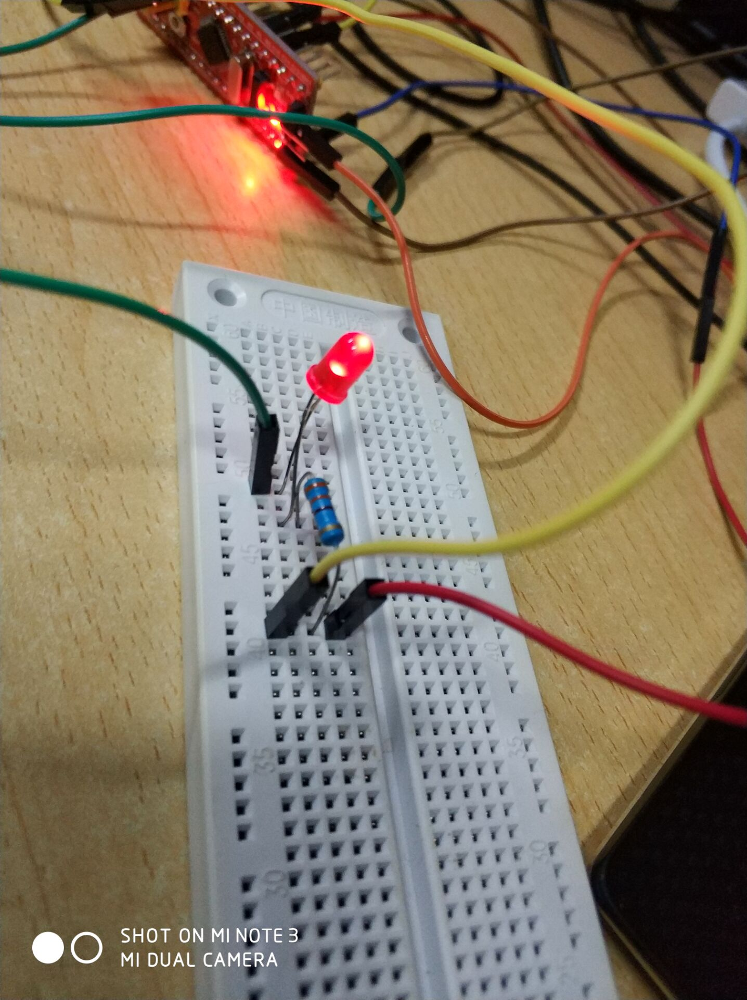

# 分析cube的库引入方式
## 1. 创建一个空的项目
## 2. 引入模块
在`Inc/main.h`中将需要引入的模块注释取消



这里将GPIO,UART,ADC三个模块注释取消了

在`makefile`中添加相应的源文件



因为gpio的源文件默认就已经添加了，所以只要加uart和adc的源文件即可

## 3. 编写外设初始化函数
### GPIO
```c
void MY_GPIO_Init(){
  __HAL_RCC_GPIOA_CLK_ENABLE();//启用GPIO A组引脚
  GPIO_InitTypeDef GPIO_InitStruct;//GPIO配置器

  //PA9 串口输出
  GPIO_InitStruct.Pin = GPIO_PIN_9;//配置的引脚号
  GPIO_InitStruct.Mode = GPIO_MODE_AF_PP;//引脚模式
  GPIO_InitStruct.Speed = GPIO_SPEED_FREQ_HIGH;//引脚速度
  HAL_GPIO_Init(GPIOA, &GPIO_InitStruct);//配置相应的引脚

  //PA10 串口输入
  GPIO_InitStruct.Pin = GPIO_PIN_10;
  GPIO_InitStruct.Mode = GPIO_MODE_INPUT;
  GPIO_InitStruct.Pull = GPIO_NOPULL;//引脚拉高or拉低ornull
  HAL_GPIO_Init(GPIOA, &GPIO_InitStruct);

  //PA8 输出用于闪烁灯
  GPIO_InitStruct.Pin = GPIO_PIN_8;
  GPIO_InitStruct.Mode = GPIO_MODE_OUTPUT_PP;
  HAL_GPIO_Init(GPIOA, &GPIO_InitStruct);

}
```
### UART
先要定义一个全局变量 huart1，因为除了初始化，使用的时候也要用到这个变量
```c
/* Private variables ---------------------------------------------------------*/
UART_HandleTypeDef huart1;
/* USER CODE BEGIN PV */
```
```c
void MY_UART_Init(){
  huart1.Instance = USART1;// 启用USART1， 还可以用2,3，USART123是相应寄存器的地址
  huart1.Init.BaudRate = 9600;// 设置波特率 9600
  huart1.Init.WordLength = UART_WORDLENGTH_8B;// 设置数据位 8bit
  huart1.Init.StopBits = UART_STOPBITS_1;// 设置停止位 1
  huart1.Init.Parity = UART_PARITY_NONE;// 设置奇偶校验位 无
  huart1.Init.Mode = UART_MODE_TX_RX;// 设置串口模式，全双工
  huart1.Init.HwFlowCtl = UART_HWCONTROL_NONE;//设置流控 无
  huart1.Init.OverSampling = UART_OVERSAMPLING_16;//设置过采样 16倍
  if (HAL_UART_Init(&huart1) != HAL_OK) //初始化串口
  {
    _Error_Handler(__FILE__, __LINE__);//初始化失败
  }
}
```
### ADC
先要定义一个全局变量 hadc1，因为除了初始化，使用的时候也要用到这个变量
```c
/* Private variables ---------------------------------------------------------*/
UART_HandleTypeDef huart1;
ADC_HandleTypeDef hadc1;
/* USER CODE BEGIN PV */
```
```c
void MY_ADC_Init(){
  hadc1.Instance = ADC1;//启用ADC1 还可以是ADC2
  hadc1.Init.ScanConvMode = ADC_SCAN_DISABLE;//不使用扫描模式
  hadc1.Init.ContinuousConvMode = DISABLE;//使用单一模式
  hadc1.Init.DiscontinuousConvMode = DISABLE;//不使用间断模式
  hadc1.Init.ExternalTrigConv = ADC_SOFTWARE_START;//关闭外部触发
  hadc1.Init.DataAlign = ADC_DATAALIGN_RIGHT;//数据右对齐
  hadc1.Init.NbrOfConversion = 1;//一组一通道，因为没用到间断模式
  if (HAL_ADC_Init(&hadc1) != HAL_OK)//初始化adc
  {
    _Error_Handler(__FILE__, __LINE__);
  }

  ADC_ChannelConfTypeDef sConfig;//通道配置器
  sConfig.Channel = ADC_CHANNEL_0;//配置通道0
  sConfig.Rank = ADC_REGULAR_RANK_1;//配置为常规组
  sConfig.SamplingTime = ADC_SAMPLETIME_1CYCLE_5;//采样时间1.5个ADC时钟周期
  if (HAL_ADC_ConfigChannel(&hadc1, &sConfig) != HAL_OK)//初始化ADC通道
  {
    _Error_Handler(__FILE__, __LINE__);
  }
}
```

除此之外，adc还需要修改时钟配置函数，为其初始化时钟
```c
  PeriphClkInit.PeriphClockSelection = RCC_PERIPHCLK_ADC;
  PeriphClkInit.AdcClockSelection = RCC_ADCPCLK2_DIV2;
  if (HAL_RCCEx_PeriphCLKConfig(&PeriphClkInit) != HAL_OK)
  {
    _Error_Handler(__FILE__, __LINE__);
  }
```
在`stm32f1xx_hal_msp.c`中增加下面两个函数，用于adc在mcu上的初始化
```c
void HAL_ADC_MspInit(ADC_HandleTypeDef* hadc)
{

  GPIO_InitTypeDef GPIO_InitStruct;
  if(hadc->Instance==ADC1)
  {
  /* USER CODE BEGIN ADC1_MspInit 0 */

  /* USER CODE END ADC1_MspInit 0 */
    /* Peripheral clock enable */
    __HAL_RCC_ADC1_CLK_ENABLE();
  
    /**ADC1 GPIO Configuration    
    PA0-WKUP     ------> ADC1_IN0 
    */
    GPIO_InitStruct.Pin = GPIO_PIN_0;
    GPIO_InitStruct.Mode = GPIO_MODE_ANALOG;
    HAL_GPIO_Init(GPIOA, &GPIO_InitStruct);

  /* USER CODE BEGIN ADC1_MspInit 1 */

  /* USER CODE END ADC1_MspInit 1 */
  }

}

void HAL_ADC_MspDeInit(ADC_HandleTypeDef* hadc)
{

  if(hadc->Instance==ADC1)
  {
  /* USER CODE BEGIN ADC1_MspDeInit 0 */

  /* USER CODE END ADC1_MspDeInit 0 */
    /* Peripheral clock disable */
    __HAL_RCC_ADC1_CLK_DISABLE();
  
    /**ADC1 GPIO Configuration    
    PA0-WKUP     ------> ADC1_IN0 
    */
    HAL_GPIO_DeInit(GPIOA, GPIO_PIN_0);

  /* USER CODE BEGIN ADC1_MspDeInit 1 */

  /* USER CODE END ADC1_MspDeInit 1 */
  }

}
```
## 4. 使用外设
先调用初始化函数初始化各个外设
```c
  SystemClock_Config();
  MY_GPIO_Init();
  MY_UART_Init();
  MY_ADC_Init();
```
使用外设 ADC和串口部分代码引用自KozakaiAya
```c
  HAL_ADCEx_Calibration_Start(&hadc1);
  
  uint32_t adc1_value;
  float adc1_v;
  char buf[100];
  /* USER CODE END 2 */

  /* Infinite loop */
  /* USER CODE BEGIN WHILE */
  HAL_ADC_Start(&hadc1);
  while (1)
  {

  /* USER CODE END WHILE */

  /* USER CODE BEGIN 3 */
   HAL_GPIO_TogglePin(GPIOA,GPIO_PIN_8);//闪烁
   HAL_Delay(500);
   HAL_ADC_PollForConversion(&hadc1, 100);//轮询adc
   adc1_value = HAL_ADC_GetValue(&hadc1);//取得测到的值
   adc1_v = (float)adc1_value / 4095 * 3.3;//值换算
   sprintf(buf, "Current Voltage is: %.2f\n", adc1_v);
   HAL_UART_Transmit(&huart1, (uint8_t*)buf, strlen(buf), 0xFFFF);//串口输出
  }
  HAL_ADC_Stop(&hadc1);
```

使用这个测试代码还应该使用stm32的浮点输出需要修改makefile，具体参考KozakaiAya的ADC_Basic.md


