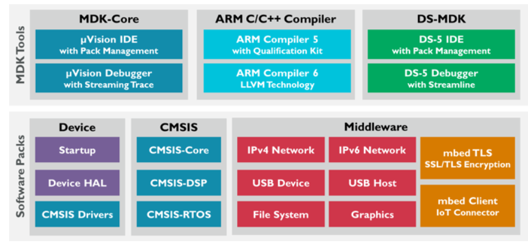
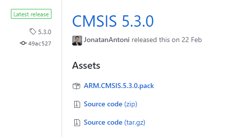
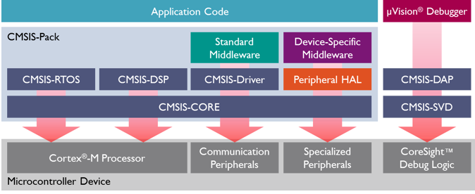
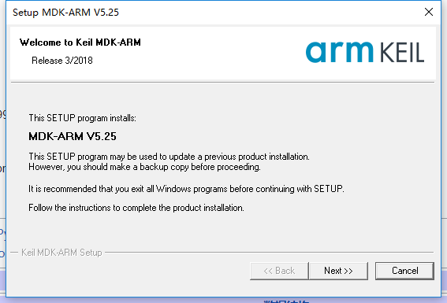
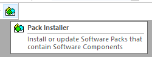
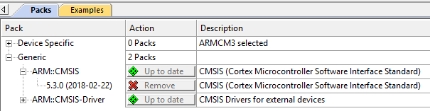
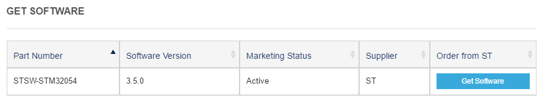
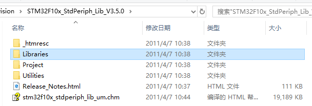

### Product Components

All the CMSIS functions are packed in a .pack file. Then we need a software/toolchain to take advantage of the .pack file and its name is $$\mu$$**Vision IDE**. You can download $$\mu$$**Vision IDE** [here][www.keil.com/mdk5/install]. The software is briefly introduced at http://www2.keil.com/mdk5.

Then we will talk about the **CMSIS**, it is just a single part of the tool chains but not all of them.




### Components of CMSIS

CMSIS is short for **The Cortex Microcontroller Software Interface Standard**. It provides a ground-up software framework for embedded applications that run on Cortex-M based microcontrollers. You can download the .pack file or the source code of the latest version of CMSIS [here][https://github.com/ARM-software/CMSIS_5/releases/tag/5.3.0].



- **CMSIS-CORE**：提供与 Cortex-M0、Cortex-M3、Cortex-M4、SC000 和 SC300 处理器与外围寄存器之间的接口
- CMSIS-DSP：包含以定点（分数 q7、q15、q31）和单精度浮点（32 位）实现的 60 多种函数的 DSP 库
- **CMSIS-RTOS API**：用于线程控制、资源和时间管理的实时操作系统的标准化编程接口
- CMSIS-SVD：(SVD=System View Description) 包含完整微控制器系统（包括外设）的程序员视图的系统视图描述 XML 文件
- CMSIS-Pack：可被MDK所使用，为设备接口和驱动等提供软件包支持
- **CMSIS-Driver**：连接应用层和中间层以及外围设备的接口





### CMSIS-CORE

**CMSIS-Core (Cortex-M)** implements the basic run-time system for a Cortex-M device and gives the user access to the processor core and the device peripherals. 

In detail it defines:

- **Hardware Abstraction Layer (HAL)** for Cortex-M processor registers with standardized definitions for the SysTick, NVIC, System Control Block registers, MPU registers, FPU registers, and core access functions.
- **System exception names** to interface to system exceptions without having compatibility issues.
- **Methods to organize header files** that makes it easy to learn new Cortex-M microcontroller products and improve software portability. This includes naming conventions for device-specific interrupts.
- **Methods for system initialization** to be used by each MCU vendor. For example, the standardized [SystemInit()](http://arm-software.github.io/CMSIS_5/Core/html/group__system__init__gr.html#ga93f514700ccf00d08dbdcff7f1224eb2) function is essential for configuring the clock system of the device.
- **Intrinsic functions** used to generate CPU instructions that are not supported by standard C functions.
- A variable to determine the **system clock frequency** which simplifies the setup of the SysTick timer.

Note: In the CMSIS basic source code, there are no supports for specific boards(e.g. stm32f10x). If we want to apply CMSIS on a specific device/board(e.g. stm32f10x), we need to download an additional pack from the official websites like **Keil**. 


#### Using CMSIS in Embedded Applications

After we download the **CMSIS** pack and the specific pack for **stm32f10x**, we can find these files:

| File name                                       | Path                                             |
| ----------------------------------------------- | ------------------------------------------------ |
| **core_cm3.h**                                  | CMSIS\CM3\CoreSupport                            |
| **startup_stm32f10x_\*\*.s**                    | CMSIS\CM3\DeviceSupport\ST\STM32F10x\startup\arm |
| **system_stm32f10x.c** & **system_stm32f10x.h** | CMSIS\CM3\DeviceSupport\ST\STM32F10x             |

The CMSIS-Core File Structure is showed as followed:

In our labs, <device> is "**stm32f10x**", and <cpu> is "**cm3**".


#### Accessing Cortex-M3 NVIC registers using CMSIS

**Nested Vector Interrupt Controller(NVIC)** is used for controlling the interrupts and exceptions in the Cortex-M3 processor. With CMSIS, we can easily control the interrupts and exceptions processes. 

We may notice that there are two functions `__disable_irq(void)` and `__enable_irq(void)` in the next part. They control all the interrupts but **NVIC** can control the interrupts seperately according to the IRQ number. (See 4.2.10 in the pdf)

| CMSIS function                                           | Description                                                  |
| -------------------------------------------------------- | ------------------------------------------------------------ |
| void NVIC_EnableIRQ(IRQn_Type IRQn)                      | Enables an interrupt or exception.                           |
| void NVIC_DisableIRQ(IRQn_Type IRQn)                     | Disables an interrupt or exception.                          |
| void NVIC_SetPendingIRQ(IRQn_Type IRQn)                  | Sets the pending status of interrupt or exception to 1.      |
| void NVIC_ClearPendingIRQ(IRQn_Type IRQn)                | Clears the pending status of interrupt or exception to 0.    |
| uint32_t NVIC_GetPendingIRQ(IRQn_Type IRQn)              | Reads the pending status of interrupt or exception. This function returns non-zero value if the pending status is set to 1. |
| void NVIC_SetPriority(IRQn_Type IRQn, uint32_t priority) | Sets the priority of an interrupt or exception with configurable priority level to 1. |
| uint32_t NVIC_GetPriority(IRQn_Type IRQn)                | Reads the priority of an interrupt or exception with configurable priority level. This function return the current priority level. |

The list of IRQ numbers is showed as followed:

| IRQn numbers            | Description                                                  |
| ----------------------- | ------------------------------------------------------------ |
| *HardFault_IRQn*        | Exception 3: Hard Fault Interrupt.                           |
| *MemoryManagement_IRQn* | Exception 4: Memory Management Interrupt [not on Cortex-M0 variants]. |
| *BusFault_IRQn*         | Exception 5: Bus Fault Interrupt [not on Cortex-M0 variants]. |
| *UsageFault_IRQn*       | Exception 6: Usage Fault Interrupt [not on Cortex-M0 variants]. |
| *SecureFault_IRQn*      | Exception 7: Secure Fault Interrupt [only on Armv8-M].       |
| *SVCall_IRQn*           | Exception 11: SV Call Interrupt.                             |
| *DebugMonitor_IRQn*     | Exception 12: Debug Monitor Interrupt [not on Cortex-M0 variants]. |
| *PendSV_IRQn*           | Exception 14: Pend SV Interrupt [not on Cortex-M0 variants]. |
| *SysTick_IRQn*          | Exception 15: System Tick Interrupt.                         |
| *WWDG_STM_IRQn*         | Device Interrupt 0: Window WatchDog Interrupt.               |
| *PVD_STM_IRQn*          | Device Interrupt 1: PVD through EXTI Line detection Interrupt. |
| *NonMaskableInt_IRQn*   | Exception 2: Non Maskable Interrupt.                         |


#### CMSIS functions on Cortex-M3

For Cortex-M3 processors, CMSIS functions may help us generate some Cortex-M3 instructions:

| Instructions | CMSIS function                       |
| ------------ | ------------------------------------ |
| CPSIE I      | void __enable_irq(void)              |
| CPSID I      | void __disable_irq(void)             |
| CPSIE F      | void __enable_fault_irq(void)        |
| CPSID F      | void __disable_fault_irq(void)       |
| ISB          | void __ISB(void)                     |
| DSB          | void __DSB(void)                     |
| DMB          | void __DMB(void)                     |
| REV          | uint32_t __REV(uint32_t int value)   |
| REV16        | uint32_t __REV16(uint32_t int value) |
| REVSH        | uint32_t __REVSH(uint32_t int value) |
| RBIT         | uint32_t __RBIT(uint32_t int value)  |
| SEV          | void __SEV(void)                     |
| WFE          | void __WFE(void)                     |
| WFI          | void __WFI(void)                     |

The CMSIS also provides a number of functions for accessing the special registeers usinig MRS and MSR instructions.

| **Instructions** | Access | CMSIS function                          |
| ---------------- | ------ | --------------------------------------- |
| PRIMASK          | Read   | uint32_t __get_PRIMASK(void)            |
|                  | Write  | void __set_PRIMASK(uint32_t value)      |
| FAULTMASK        | Read   | uint32_t __get_FAULTMASK(void)          |
|                  | Write  | void __set_FAULTMASK(uint32_t value)    |
| BASEPRI          | Read   | uint32_t __get_BASEPRI(void)            |
|                  | Write  | void __set_BASEPRI(uint32_t value)      |
| CONTROL          | Read   | uint32_t __get_CONTROL(void)            |
|                  | Write  | void __set_CONTROL(uint32_t value)      |
| MSP              | Read   | uint32_t __get_MSP(void)                |
|                  | Write  | void __set_MSP(uint32_t TopOfMainStack) |
| PSP              | Read   | uint32_t __get_PSP(void)                |
|                  | Write  | void __set_PSP(uint32_t TopOfProcStack) |

#### Basic Example

```c
#include <stm32f10x.h>                           // File name depends on device used
 
uint32_t volatile msTicks;                       // Counter for millisecond Interval
 
void SysTick_Handler (void) {                    // SysTick Interrupt Handler
  msTicks++;                                     // Increment Counter
}
 
void WaitForTick (void)  {
  uint32_t curTicks;
 
  curTicks = msTicks;                            // Save Current SysTick Value
  while (msTicks == curTicks)  {                 // Wait for next SysTick Interrupt
    __WFE ();                                    // Power-Down until next Event/Interrupt
  }
}
 
void TIM1_UP_IRQHandler (void) {                 // Timer Interrupt Handler
  ;                                              // Add user code here
}
 
void timer1_init(int frequency) {                // Set up Timer (device specific)
  NVIC_SetPriority (TIM1_UP_IRQn, 1);            // Set Timer priority
  NVIC_EnableIRQ (TIM1_UP_IRQn);                 // Enable Timer Interrupt
}
 
 
void Device_Initialization (void)  {             // Configure & Initialize MCU
  if (SysTick_Config (SystemCoreClock / 1000)) { // SysTick 1mSec
       : // Handle Error 
  }
  timer1_init ();                                // setup device-specific timer
}
 
 
// The processor clock is initialized by CMSIS startup + system file
void main (void) {                                   // user application starts here
  Device_Initialization ();                      // Configure & Initialize MCU
  while (1)  {                                   // Endless Loop (the Super-Loop)
    __disable_irq ();                            // Disable all interrupts
    Get_InputValues ();                          // Read Values
    __enable_irq ();                             // Enable all interrupts 
    Calculation_Response ();                     // Calculate Results
    Output_Response ();                          // Output Results
    WaitForTick ();                              // Synchronize to SysTick Timer
  }
}
```


1. The functions start with "__" are all related to a specific or hint CPU core instruction. Some examples:

   **__disable_irq()**:  = CPSID i. Set PRIMASK.

   **__enable_irq()**:  = CPSIE i. Clear PRIMASK.

   **__WFE()**: = WFE.  "Wait For Events", permits the processor to enter a low-power state until an event occurs.

2. About the system **clock**:

   The `SysTick_Config()` function generates interrupt requests on a regular basis. 

   `SystemCoreClock` is a global variable which contains the system core clock value(frequency).

   By the way, `SystemCoreClockUpdate()` is used to refresh the clock frequency at the beginning of `main()`. 

   And `SystemInit()` is used to initialize the whole system, which is called by the **startup_*device*.s** file.

3. About the system **timer**:

```c
void Device_Initialization (void)  {             // Configure & Initialize MCU
  if (SysTick_Config (SystemCoreClock / 1000)) { // SysTick 1mSec
       : // Handle Error 
  }
  timer1_init ();                                // setup device-specific timer
}
```

The `SysTick_Handler()` function is for the handler of system clock interrupt. The entrance has been **fixed** in the header file.

```c
void SysTick_Handler (void) {                    // SysTick Interrupt Handler
  msTicks++;                                     // Increment Counter
}
```

4. Two NVIC functions are used in the `timer1_init()` function.

```c
void timer1_init(int frequency) {                // Set up Timer (device specific)
  NVIC_SetPriority (TIM1_UP_IRQn, 1);            // Set Timer priority
  NVIC_EnableIRQ (TIM1_UP_IRQn);                 // Enable Timer Interrupt
}
```


###CMSIS-Driver

####Common Driver Functions

Each CMSIS-Driver contains these functions:

- **GetVersion:** can be called at any time to obtain version information of the driver interface.

- **GetCapabilities:** can be called at any time to obtain capabilities of the driver interface.

- Initialize: must be called before powering the peripheral using **PowerControl**. This function performs the following:

  - allocate I/O resources.
    - register an optional **SignalEvent** callback function.

- **SignalEvent:** is an optional callback function that is registered with the **Initialize** function. This callback function is initiated from interrupt service routines and indicates hardware events or the completion of a data block transfer operation.

- **PowerControl**:

  Controls the power profile of the peripheral and needs to be called after **Initialize**. Typically, three power options are available:

  - `ARM_POWER_FULL:` Peripheral is turned on and fully operational. The driver initializes the peripheral registers, interrupts, and (optionally) DMA.
  - `ARM_POWER_LOW:` (optional) Peripheral is in low power mode and partially operational; usually, it can detect external events and wake-up.
  - `ARM_POWER_OFF:` Peripheral is turned off and not operational (pending operations are terminated). This is the state after device reset.

- **Uninitialize:** Complementary function to Initialize. Releases the I/O pin resources used by the interface.

- **Control:** Several drivers provide a control function to configure communication parameters or execute miscellaneous control functions.


The function call sequences:


An example:

```c
void mySPI_Thread(void const* arg)
{
    ARM_DRIVER_SPI* SPIdrv = &Driver_SPI0;
    osEvent evt;
    /* Initialize the SPI driver */
    SPIdrv->Initialize(mySPI_callback);
    /* Power up the SPI peripheral */
    SPIdrv->PowerControl(ARM_POWER_FULL);
    /* Configure the SPI to Master, 8-bit mode @10000 kBits/sec */
    SPIdrv->Control(ARM_SPI_MODE_MASTER | ARM_SPI_CPOL1_CPHA1 | ARM_SPI_MSB_LSB | ARM_SPI_SS_MASTER_SW | ARM_SPI_DATA_BITS(8), 10000000);
 
    /* SS line = INACTIVE = HIGH */
    SPIdrv->Control(ARM_SPI_CONTROL_SS, ARM_SPI_SS_INACTIVE);
 
    /* thread loop */
    while (1)
    {
        /* SS line = ACTIVE = LOW */
        SPIdrv->Control(ARM_SPI_CONTROL_SS, ARM_SPI_SS_ACTIVE);
        /* Transmit some data */
        SPIdrv->Send(testdata_out, sizeof(testdata_out));
        /* Wait for completion */
        evt = osSignalWait(0x01, 100);
        if (evt.status == osEventTimeout) {
            __breakpoint(0); /* Timeout error: Call debugger */
        }
        /* SS line = INACTIVE = HIGH */
        SPIdrv->Control(ARM_SPI_CONTROL_SS, ARM_SPI_SS_INACTIVE);
        /* SS line = ACTIVE = LOW */
        SPIdrv->Control(ARM_SPI_CONTROL_SS, ARM_SPI_SS_ACTIVE);
        /* Receive 8 bytes of reply */
        SPIdrv->Receive(testdata_in, 8);
        evt = osSignalWait(0x01, 100);
        if (evt.status == osEventTimeout) {
            __breakpoint(0); /* Timeout error: Call debugger */
        }
        /* SS line = INACTIVE = HIGH */
        SPIdrv->Control(ARM_SPI_CONTROL_SS, ARM_SPI_SS_INACTIVE);
    }
}
```


### How to use the toolchain(Not finished)

1. Download MDK-ARM V5.25 at www.keil.com/mdk5/install



2. Open the $$\mu$$Vision IDE and press Pack installer in the toolbar.



3. You must check if CMSIS is in the list of installed packs.



- If not, you can download the pack [here][https://github.com/ARM-software/CMSIS_5/releases/tag/5.3.0], or generate the pack by yourself. (See "**How to generate a CMSIS pack**") at the bottom.

4. Download the STM32 standard peripherals library [here][http://www.st.com/content/st_com/en/products/embedded-software/mcus-embedded-software/stm32-embedded-software/stm32-standard-peripheral-libraries/stsw-stm32054.html]. Please make sure that your Part Number is named **STSW-STM32054**. (IMPORTANT !!) This part is specific for **stm32f1xx** devices. Note that before you have access to the software you need to register & login, or just provide your full name and e-mail address.



5. Unzip **en.stsw-stm32054.zip**, and copy the "Libraries" directory to our own project directory.



6. Create three new directories "app", "doc" and "bsp" in the project directory.


### How to generate a CMSIS pack 

1. Download and install **doxygen.exe(1.8.6)**, **mscgen.exe(0.20)**, **7z.exe(16.02)**
2. Run **CMSIS\Utilities\gen_pack.bat**
3. If it says there is no command named "xcopy", then add **Windows\System32** to the **PATH** environment variable


4. Wait for the **.bat** to dealing with the documents


5. The **.pack** file is generated at \Local_Release directory.


