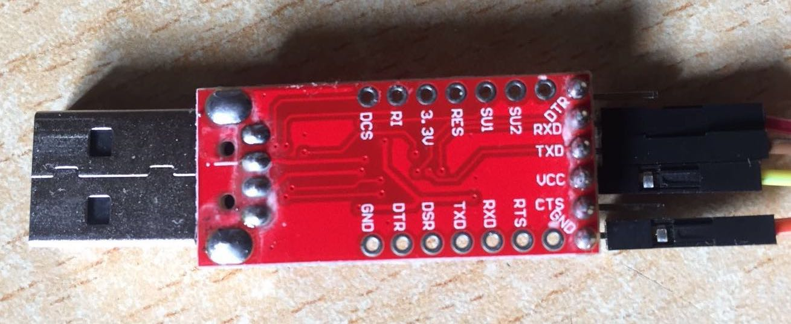
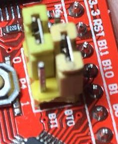
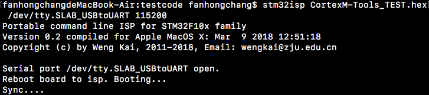
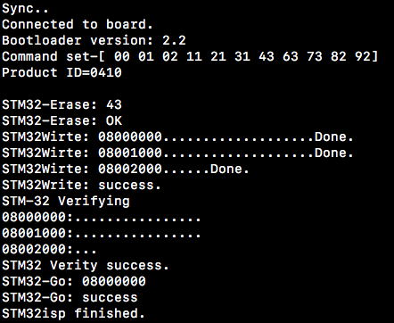
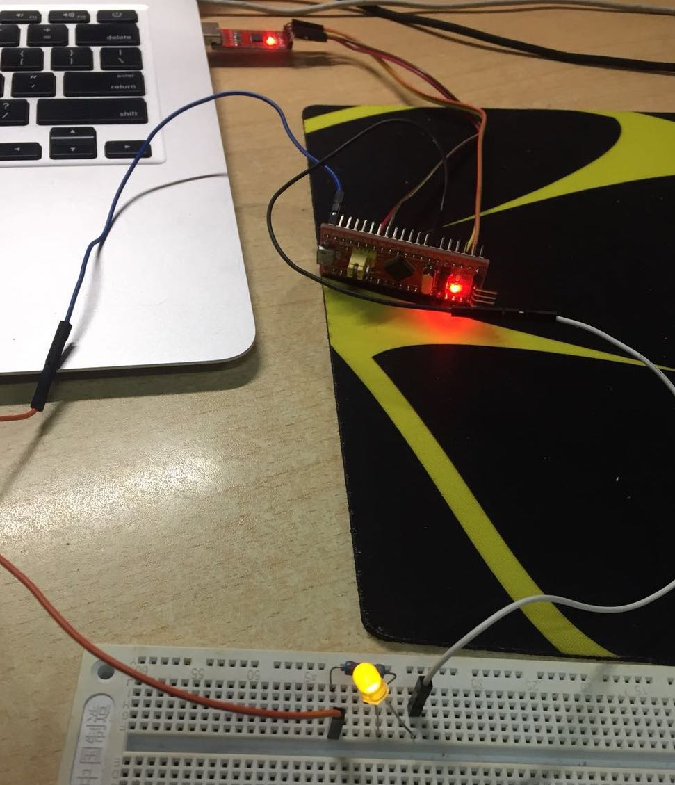

# 命令行的串口下载工具-MacOS

## USB转串口芯片驱动
实验套装中有一个USB转串口芯片，使用该芯片需要安装该芯片的驱动，这里是[下载地址](https://cn.silabs.com/products/development-tools/software/usb-to-uart-bridge-vcp-drivers)

找到MacOS对应的驱动下载安装即可，注意在安装过程中需要在系统设置中允许其安装。
## 串口连接方式
使用杜邦线将USB转串口芯片连接到stm32板上，具体连接方式为：
<table>
  <tr>
    <th  bgcolor=yellow>STM32</th>
    <th  bgcolor=yellow>USB转串口芯片</th>
  </tr>
  <tr>
    <td> 5V </td>
    <td> VCC </td>
  </tr>
  <tr>
    <td> GND </td>
    <td> GND </td>
  <tr>
    <td> A9 </td>
    <td> RXD </td>
  </tr>
  <tr>
    <td> A10 </td>
    <td> TXD </td>
  </tr>
</table>

连接完毕后使用跳线帽将stm32板上的BT0（即BOOT0）接到1，BT1（即BOOT1）接到0(如下图），这样是为了将stm32的执行方式改为执行ROM中的程序，ROM中是厂家烧录的程序，用于支持将程序下载到Flash储存中，在下载完成后要将BT0改到0，转换到执行Flash储存的程序（即刚刚烧录的程序）。

## MacOS串口下载工具
Github上翁恺老师写了一个适用于Unix系统的串口下载工具stm32isp，[这里是地址](https://github.com/wengkai/stm32isp), clone到本地编译安装（make install）后即可在终端直接使用该工具。
## 进行下载
4根线连接完成后将USB插入电脑，此时可以在终端中找到/dev目录下找到一个新的tty.SLAB_USBtoUART设备，说明驱动成功安装并连接，这时候就可以使用stm32isp工具将hex文件下载到单片机

cd进入之前的测试代码testcode文件夹，输入
`stm32isp CortexM-Tools_TEST.hex /dev/tty.SLAB_USBtoUART 115200`

第一个参数是hex文件路径，第二个参数是串口设备文件，最后一个参数是波特率，工具的详细使用方式运行工具后有提示。下载工具运行后会开始连接，等到出现sync后迅速按下stm32上的reset按钮一秒并松开，即可开始下载。

## 下载结果验证

下载完毕后可以通过测试A2端口能否控制LED灯的闪烁来确认是否下载成功。(记得将BOOT跳线帽重新连接到0）
具体连接方式如下：

将stm32的A2端口接到LED灯的正极，串联一个实验套装中的电阻后连回stm32上的GND端口，stm32的供电可以通过保持USB转串口芯片的连接，并保持与电脑的连接来供应5V电源。

观察LED灯是否闪烁，若闪烁即证明下载成功。
