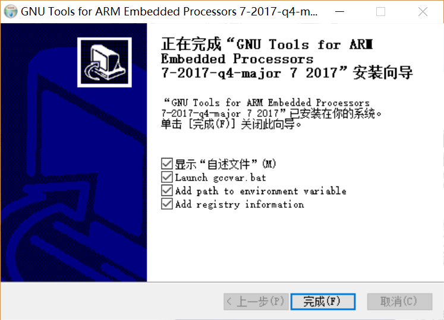
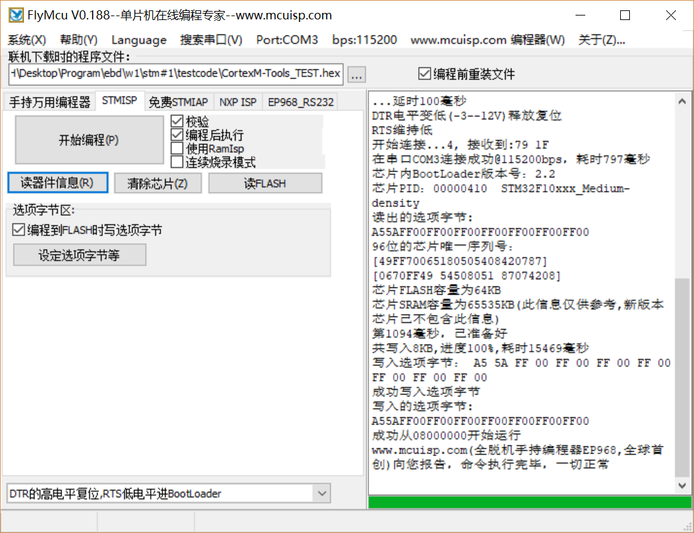
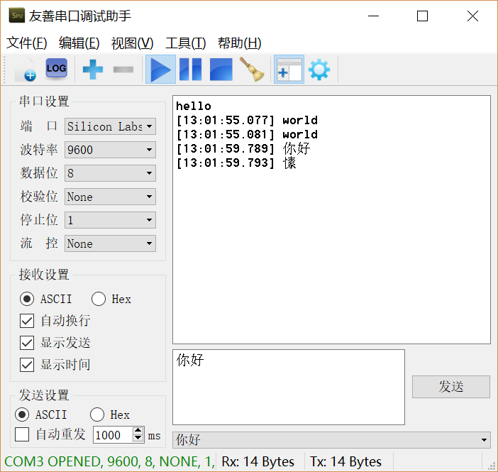

# 命令行的C语言交叉编译器-Windows
## 要求
如何在Windows上安装配置可以交叉编译在STM32F103上运行的程序的C语言编译器
## 方法
1. 在[https://developer.arm.com/open-source/gnu-toolchain/gnu-rm/downloads](https://developer.arm.com/open-source/gnu-toolchain/gnu-rm/downloads)下载最新的gcc的交叉编译工具链 for windows
2. 正常安装gcc-arm-none-eabi，直到最后一步，勾选将gcc-arm-none-eabi添加到环境变量

3. 下载[测试代码](https://github.com/zucsebd2018/CortexM-Tools/tree/master/testcode)
4. make 生成hex文件

5. 按照测试代码的readme接线，使用flymcu烧录程序(注意最底端的高低电平设置)

6. 使用串口调试工具调试（注意需要去掉rst和dtr的接线再测试), 可以观察到该程序达到了预期的echo的效果，说明生成的hex文件正确，交叉编译器配置成功。
