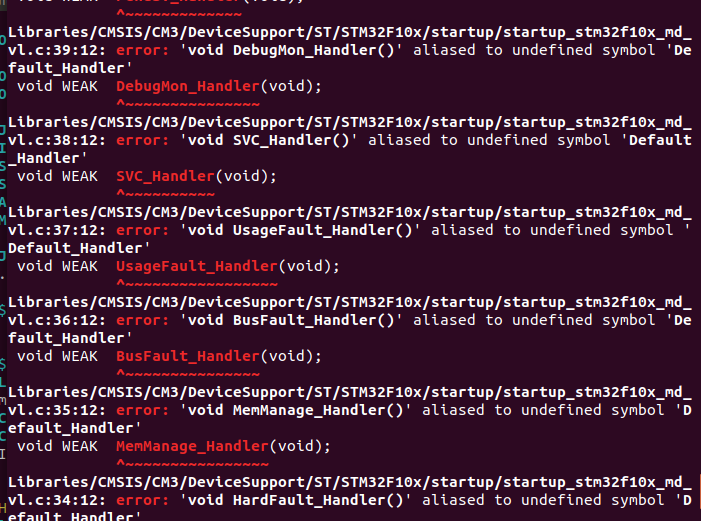
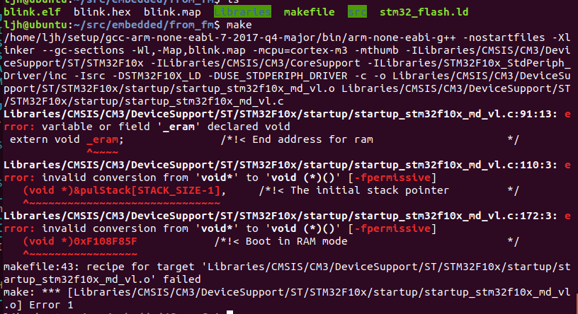
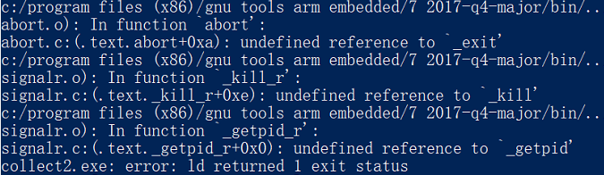
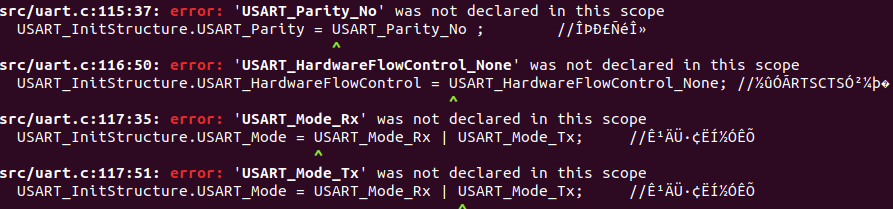

### Issue 52 Makefile

实验过程

1. 先是重新把文件排布了一下，然后找到很多错误，比如uart.c的许多函数找不到
2. 要到了老师的工程，用gcc可以编译通过，然后把gcc换成g++，如下：

```makefile
TOOLPREFIX = arm-none-eabi
CC = $(TOOLPREFIX)-g++  # 原来是-gcc
OBJCOPY = $(TOOLPREFIX)-objcopy
```

3. 产生了一些错误，以下是其中的一些。在gcc编译时没有出现过这些错误，原因是这些文件依然是用c写的，与g++兼容性不太好。需要在startup.c里加上"extern "C"{}"



4. 用extern "C" 使得上面的错误被消除，但是又出现了以下的错误



原因是g++对变量的类型要求要比gcc更严格，于是就把这三行改成了以下的代码，以上错误得以解决。

```c++
extern void* _eram;  // 1. 把void改成void*
...
typedef void (*NoParam)(void);  // 这一行是新加上去的

void (* const g_pfnVectors[])(void) =
{
    (NoParam)(pulStack + STACK_SIZE - 1),  // 2. 原来是：(void*)&pulStack[STACK_SIZE-1] 
    ...
    (NoParam)0xF108F85F 	// 3. 原来是：(void*)0xF108F85F
}
```

5. 另外一类错误如下：



​	这一种错误是因为编译选项不太对，所以需要作以下的修改，加上**-specs=nosys.specs**，删除**-nostartfiles**

```makefile
$(CC) -specs=nosys.specs -T"stm32_flash.ld" $(INCLUDE) $(MACRO) $(CFLAG) -o $@ $(OBJS) $(LIBS)
```

6. 对Makefile的OBJS进行修改，如下：

```makefile
OBJS = src/main.o \
	src/stm32f10x_it.o \
	src/system.o \
	src/startup.o \
	src/gpio.o \
	src/uart.o
```

还有对INCLUDE的目录也进行了修改：

```makefile
CMSISDEVICE = Libraries/CMSIS/CM3/DeviceSupport/ST/STM32F10x
CMSISCORE = Libraries/CMSIS/CM3/CoreSupport
COMPORT = /dev/tty.SLAB_USBtoUART
...
INCLUDE = \
	-I$(CMSISDEVICE)\
	-I$(CMSISCORE) \
	-Isrc/include
```

7. 最后需要把-MACRO中的**-DUSE_STDPERIPH_DRIVER**去掉。这里定义了一个宏，它会在stm32_f10x_conf.h里的外设驱动调用出来，但因为我们现在已经不需要这个库了，所以必须去掉。

```makefile
# makefile
-MACRO = -DSTM32F10X_LD -DUSE_STDPERIPH_DRIVER
```

```c
/* stm32f10x.h, Line 8296-8298 */
#ifdef USE_STDPERIPH_DRIVER
  #include "stm32f10x_conf.h"
#endif
```

​	我们可以瞄一眼stm32f10x_conf.h里的是什么内容。**这并不是在Libraries文件夹里定义的**。

```c
/* stm32f10x_conf.h, Line 22 */

/* Define to prevent recursive inclusion -------------------------------------*/
#ifndef __STM32F10x_CONF_H
#define __STM32F10x_CONF_H

/* Includes ------------------------------------------------------------------*/
/* Uncomment/Comment the line below to enable/disable peripheral header file inclusion */
#include "stm32f10x_adc.h"
#include "stm32f10x_bkp.h"
#include "stm32f10x_can.h"
#include "stm32f10x_cec.h"
#include "stm32f10x_crc.h"
#include "stm32f10x_dac.h"
#include "stm32f10x_dbgmcu.h"
#include "stm32f10x_dma.h"
#include "stm32f10x_exti.h"
#include "stm32f10x_flash.h"
#include "stm32f10x_fsmc.h"
#include "stm32f10x_gpio.h"
#include "stm32f10x_i2c.h"
#include "stm32f10x_iwdg.h"
#include "stm32f10x_pwr.h"
#include "stm32f10x_rcc.h"
#include "stm32f10x_rtc.h"
#include "stm32f10x_sdio.h"
#include "stm32f10x_spi.h"
#include "stm32f10x_tim.h"
#include "stm32f10x_usart.h"
#include "stm32f10x_wwdg.h"
#include "misc.h" /* High level functions for NVIC and SysTick (add-on to CMSIS functions) */
```


----

##以下和本次作业主要内容相关性不大

#### 用汇编编译的方法

（此部分只是mark一下，不是作业要求）

1. Makefile里改编译选项。链接时加上-specs=nosys.specs，并删除-nostartfiles。如果不删除-nostartfiles会显示类似于找不到"_startup"之
2. 类的错误。
3. Makefile里把startup.o的路径改成startup_stm32f10x_MD.s的对应路径，同时对.o的文件名也进行修改。


### 体会&教训

其实整个过程从结果倒推回去的话工作量并不是很大，造成时间浪费的主要原因是：

#### 对任务的理解不太清晰

+ 一开始不知道uart.c暂时是不能编译通过的，还需要一些别的库。当时出现了以下的一些错误，还以为自己makefile写错了，于是不断地去找各种文件的依赖关系并且把那些文件包含进来，殊不知其实后面的文件都是本次作业中所不需要的。

  

+ 不知道makefile要改的部分有哪些，以为只是改文件的路径，但其实编译选项也要改。

+ 不知道要把gcc换成g++，直到class编译出错时才反应过来

#### 没有及时求助

+ 没有及时向Google search求助，解决编译选项方面的问题。其实直接在网上搜编译的错误信息基本上都是在stm32上出的问题
+ 没有及时向老师、助教求助，了解本次作业真正要做的是什么

#### 缺乏记录

+ 记录指的是**文字记录、截图**等
+ 记录更有利于回顾问题产生的原因并为以后解决类似的问题作好准备
+ 所以虽然作业不要求写报告但还是稍微写一写比较好，**避免队友重蹈覆辙**