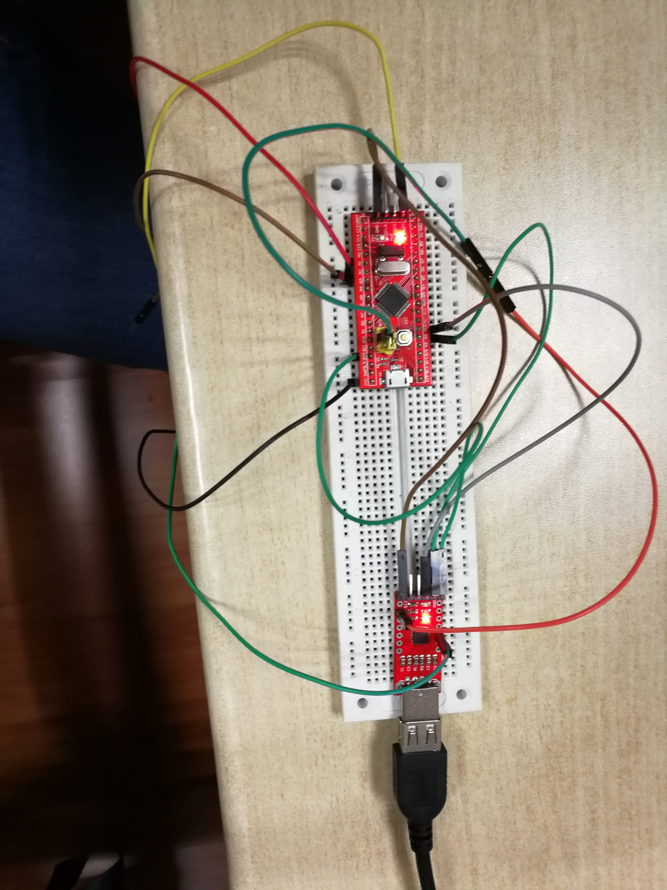
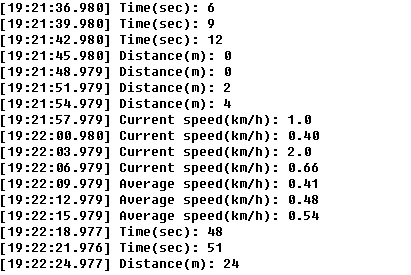
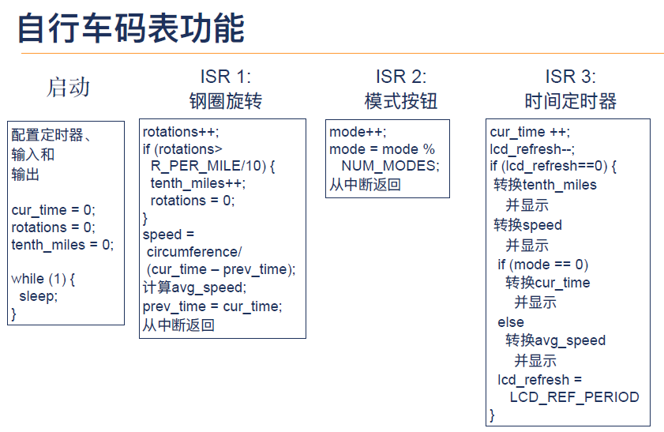

# Circle Computer


> I would rather call it a stopwatch.

This is not a tutorial-like note since I am not the first one to create this thing and make it run well in our STM32 boards. In fact, all my work is inspired by [Shihao Li](https://github.com/shihaoL/CortexM-Tools/tree/master/cyclecomputer/lishihao/src). Thanks to his work and additional help, I have my stopwatch functioned. Let's have a look first.

## Wire connection

<p></p>

*p.s. Since I had no buttons, I chose to simulate the function of them manually, i.e. to connect two wires to imitate an on button and disconnect them to imitate an off one.*

## Result

<p></p>

## Principle
Now I would like to tell you what have happened from the very begin of my work. I begun with a project only with GPIO and SysTick module.

### Programming Model

According to instructor's suggestion, the framework should look like this.
<p></p>

This design model is an interrupt-driven one, which has the following features
* Main loop does not exist and CPU will not be mainly used in busy waiting. Instead, it will sleep when nothing special happens. This helps save much energy.
* The programming model resembles the one in a event-driven GUI application.
* Event coordination can be done by management of nested interrupts and priority assignment.

It sounds great to apply the model to this issue where tasks doesn't conflict with each other, but before implementing this idea, I had to learn how to register, manage and handle interrupts.

### RCC - Real-time Clock Control
Before deploying everything, I first needed to configure RCC.
The code is in function `void RCC_Config()`, and I did not spend too much time to figure out what was going on since it has little to do with our main logic.

### EXTI - External Interrupt
For external interrupts, first I needed to have a instance of IO pin.
```C
IOPin a2(PORT_A, 2, INPUT, PULL_UP);
```
*PULL_UP* means the pin is always at a high level unless it has been connect to the ground, which means a low level. Furthermore, interrupt should be evoked when the there a negative edge appears.

Port A2 should be mounted to the 2nd interrupt line, which entails
```C
EXTI->IMR |= 1 << 2;
```
where *IMR* means Interrupt Mask Register.

As aforementioned, interrupt should be triggered when a falling edges is met, so we needs
```C
EXTI->FTSR |= 1 << 2;
```
where *FTSR* means Falling Trigger Selection Register.

Now it comes up with how to handle an external interrupt. Note that the signal is not stable, we need to take jitter into consideration. Also, after dealing with the interrupt, we should mark it. The handler looks like
```C
extern "C"
void EXTI2_IRQHandler() {
    systick->delay(10);     // anti-jitter

    /*
    * business logic
    */
    
    EXTI->PR = 1 << 2;      // mark the interrupt to be handled
}
```
where *PR* means Pending Register.

It seems that this part is relative simple.

### TIM - Timer
In terms of timer interrupts, I also needed to first configure a timer. There is lots of things to do, among which the most important one is make it trigger an interrupt once per second.

```C
// Configuration of Timer
void TIM_Config(){
    // ...

    TIM_TimeBaseStructure.TIM_Prescaler = 16000 - 1;
    TIM_TimeBaseStructure.TIM_ClockDivision = TIM_CKD_DIV1;
    TIM_TimeBaseStructure.TIM_CounterMode = TIM_CounterMode_Up;
    TIM_TimeBaseStructure.TIM_Period = 2000 - 1;

    // ...
}
```
where *16000* means 32 MHz clock has been prescaled to 2000Hz, and obviously *2000* means the interrupt interval is set to be 1Hz, i.e. one time out event per second.

Then I needed logic to handle a timer event, which looks like
```C
void TIM2_IRQHandler(){

    // ...

    if (TIM_GetITStatus(TIM2, TIM_IT_Update) != RESET) {
        TIM_ClearITPendingBit(TIM2, TIM_FLAG_Update);
        
        // business logic
    }
}
```
The condition in the if clause means we will igore the interrupt when timer is reset. and *ClearITPendingBit* is to eliminate the interrupt.

### NVIC - Nested Vectored Interrupt Controller

For nested interrupts, I needed to set their priority.
According to Shihao Li, the hierarchy of interrupts is like
```
PreemptionPriority 0
| - SubPriority 0
| - SubPriority 1
...
PreemptioPriority 1
| - SubPriority 0
| - SubPriority 1
...
...
```
where an interrupt of larger *PreemptPriority* cannot preempt the CPU from that of a smaller one. If two interrupts are of the same PreemptPriority, the one of bigger *SubPriority* cannot preempt the CPU with that of a smaller one.

Hence, my design looks like
```
PreemptionPriority 0
| - SubPriority 0 
    sensor, since every record cannot be discarded, otherwise large mistakes will be made
| - SubPriority 1
    timer, since update of time is also important

PreemptioPriority 1
| - SubPriority 0
    button, it is less important than sensor and timer
| - SubPriority 1
    USART, since it can be tolerated if the display doesn't work well sometimes
```

### Others

Enclosed please refer to my source code to further explore my design and implemenation. Pay attention to `main.c`, `Makefile` and the new file hierarchy.


