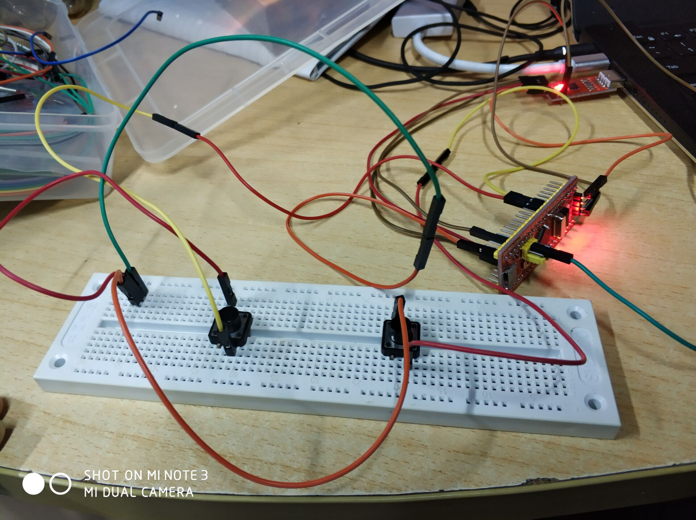
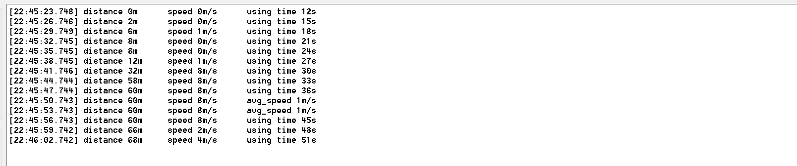

# 自行车码表

## 实现
该码表采用中断驱动的MVC设计模式
主要有三个中断: 定时器中断，传感器输入中断，按键输入中断
### 定时器中断
- 设定定时器计时时长为1s，每个定时器中断，将cur_time更新，即cur_time++，cur_time记录从系统启动到现在的计时时长，
- 同时把display--，display 变量用于控制屏幕刷新频率，我这里设置为3，即每3s刷新一次屏幕
- 由于这次实验没用到屏幕，所以用串口代替屏幕显示。每3s向pc发送"速度"和"距离"数据。再根据mode，选择发送“当前时间”还是“平均速度”
```c
void TIM2_IRQHandler(void) {
	uint32_t i;
	if(TIM_GetITStatus(TIM2, TIM_IT_Update) != RESET) {
		TIM_ClearITPendingBit(TIM2 , TIM_FLAG_Update);
		cur_time++;
		display--;
		if(display==0){
			sprintf(buffer,"distance %dm\tspeed %dm/s\t",rotation*METER_PER_R,speed);
			for( i=0;buffer[i];i++){
              USART_SendData(USART1,buffer[i]);
              //等待数据发送完毕
              while(USART_GetFlagStatus(USART1, USART_FLAG_TC)==RESET);
       		}
			if(mode==0){
				sprintf(buffer,"using time %ds\n",cur_time);
			}
			else{
				sprintf(buffer,"avg_speed %dm/s\n",avg_speed);
			}
			for( i=0;buffer[i];i++){
              USART_SendData(USART1,buffer[i]);
              //等待数据发送完毕
              while(USART_GetFlagStatus(USART1, USART_FLAG_TC)==RESET);
       		}
       		display = DISPLAY_PERIOD;
		}
	}
}
```
### 传感器中断
- 传感器输入的IO设置为输入上拉，传感器的另一头接地，当车轮滚了一圈之后，传感器闭合，会产生一个低电平。所以传感器中断设置为下降沿触发。
- 考虑到机械抖动的问题，进入传感器的中断处理函数，应当延时一段时间（10-20ms），再检测输入是否为低电平（因为是下降沿触发的),如果是的话，再进入正式处理函数
- 将rotation++,记录目前为止转的圈数，如果cur_time >pre_time,计算这段时间的速度，即(rotation-pre_rotation) x METER_PER_ROTATION / (cur_time - pre_time). 之所以要保证cur_time > pre_time是为了避免除0错误，如果骑车速度比较快，是可以在1s内转几圈的。然后更新pre_time 和 pre_rotation,为了下次计算速度
- 每次rotation++，都要更新一下avg_speed.
```c
void EXTI2_IRQHandler(void){
	st->delay(10);//去抖
	if(a2->read()==LOW){
		rotation++;
		//精度为1s
		if(cur_time>pre_time){
			speed = (rotation - pre_rotation) * METER_PER_R / (cur_time-pre_time);
			pre_time = cur_time;
			pre_rotation = rotation;
		}
		if(cur_time>0){
			avg_speed = rotation*METER_PER_R/cur_time;
		}
	}
	//清除中断标志
	EXTI->PR=1<<2;
}
```
### 按键中断
- 按键中断和传感器中断一样需要去抖
- 按键中断非常简单，只要将mode循环+1，能做到循环切换mode，就是+1再取模
```c
void EXTI3_IRQHandler(void){
	st->delay(10);//去抖
	if(a3->read()==LOW){
		mode++;
		mode = mode % NUM_MODE;
	}
	//清除中断标志
	EXTI->PR=1<<3;
}
```

## 结果
### 实物图

### 串口输出



## 遇到的困难
- 全局对象的构造函数不会被调用，导致GPIO初始化有问题，解决的方法是定义全局对象的指针，然后在main函数里面将这个指针指向main里面正确初始化的对象
- stm32的时钟系统比较复杂，uart，afio，tim这些时钟都要开启来才行，不然就没有反应
- 对stm32的中断系统不了解，花了挺长一段时间去了解