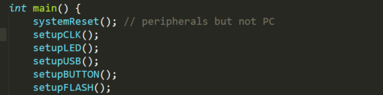
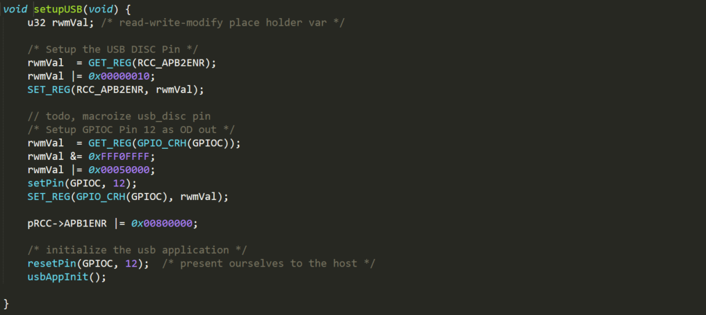
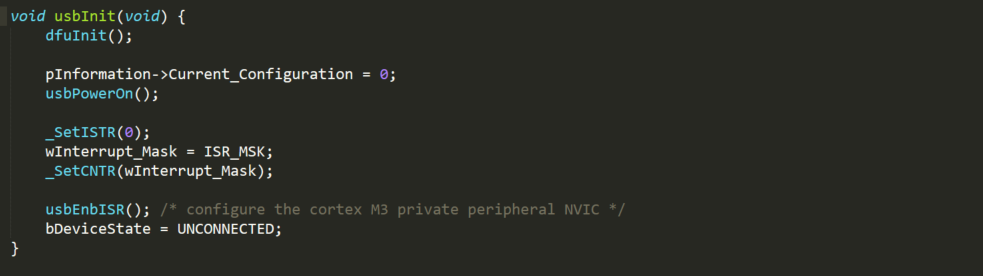
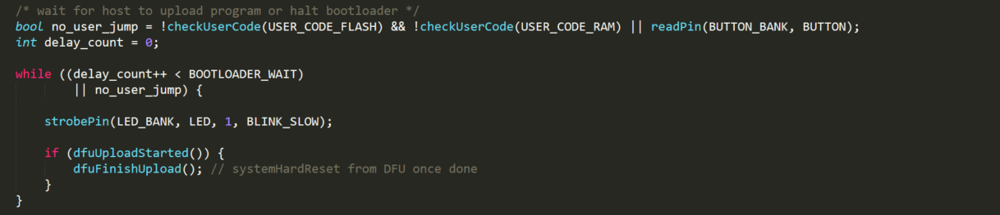
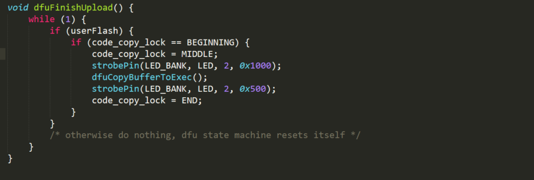
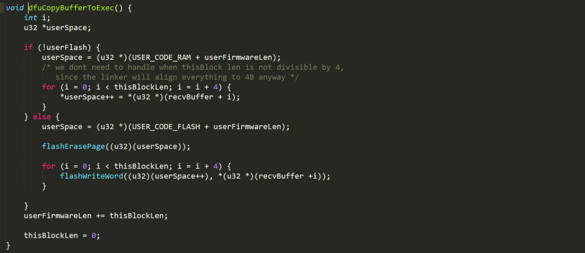
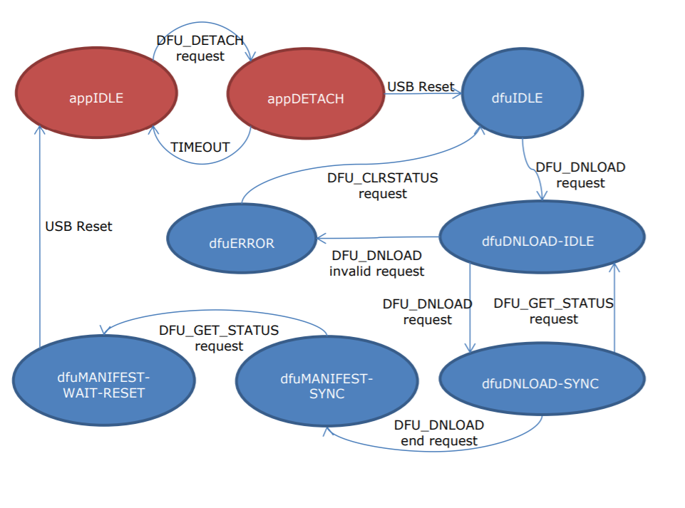
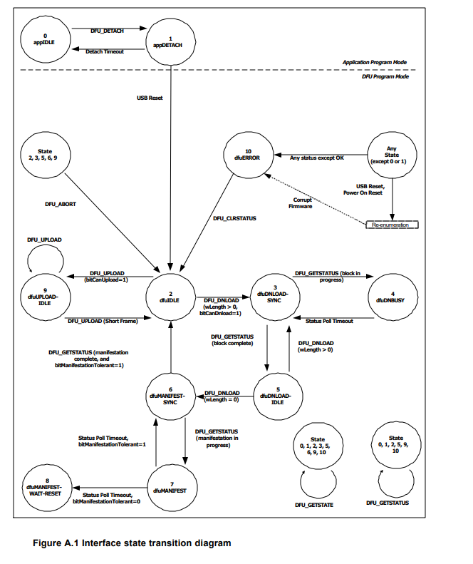
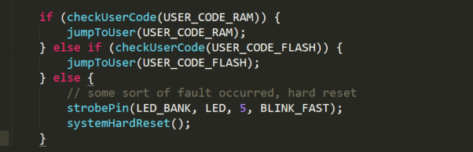
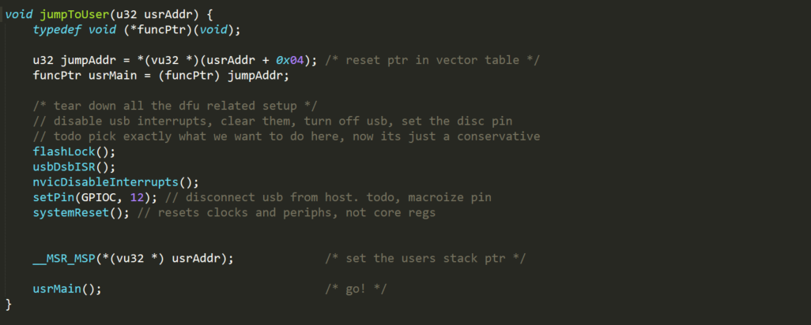

# 分析Maple BootLoader

`Maple BootLoader`源码可以在https://github.com/leaflabs/maple-bootloader 下载

BootLoader首先初始化硬件



和我们设置STM32的板子一样，就是通过写寄存器，初始化时钟，初始化LED，初始化USB，初始化按键，初始化FLASH。因为maple是用USB通信的，所以要初始化USB，我们之前是用串口的。



USB的初始化也是写一些寄存器，但是最后还调用了一个`usbAppInit`,这个函数里面又调用了`USB_Init`,`USB_Init`初始化一些全局变量之后，调用了`usbInit`



这个函数调用了`dfuInit`，初始化了dfu，dfu就是基于USB的BootLoader的协议。

回到`mian`



`no_user_jump`变量表示如果`FLASH`和`RAM`里面都没有代码或者用户按下了特殊的按键，就进入DFU模式。接下来的`while`循环的意思是，等待一段时间，这段时间内主机如果有进入DFU的请求，就进入，否则正常启动。或者当`no_user_jump`为真的时候，就一直等待主机的DFU请求。`dfuUploadStarted` 是用来检测是否有DFU请求的，`dfuFinishUpload`



这个函数负责做第一次拷贝，将Buffer中的内容拷贝到FLASH上。然后我们发现这个函数是死循环，退不出来。再接着看下去。



`dfuCopyBufferToExec`就是做拷贝的，将Buffer中的内容拷贝到FLASH或者RAM上，具体拷贝到哪根据`userFlash`确定，目的地址`USER_CODE_RAM`和`USER_CODE_FLASH`都是在头文件里面确定的宏。flash的擦写需要特殊的方式，所以这里用`flashErasePage`和`flashWriteWord`

好像看到这里，啥都没发生，死循环也退不出来，Buffer中的数据也不知道哪来，也没有其他函数了。那唯一的可能就是中断服务程序了。DFU是通过USB通信的，所以我们去找USB的中断服务程序

```c
void USB_LP_CAN1_RX0_IRQHandler(void) {
    wIstr = _GetISTR();

    /* go nuts with the preproc switches since this is an ISTR and must be FAST */
#if (ISR_MSK & ISTR_RESET)
    if (wIstr & ISTR_RESET & wInterrupt_Mask) {
        _SetISTR((u16)CLR_RESET);
        Device_Property.Reset();
    }
#endif


#if (ISR_MSK & ISTR_DOVR)
    if (wIstr & ISTR_DOVR & wInterrupt_Mask) {
        _SetISTR((u16)CLR_DOVR);
    }
#endif


#if (ISR_MSK & ISTR_ERR)
    if (wIstr & ISTR_ERR & wInterrupt_Mask) {
        _SetISTR((u16)CLR_ERR);
    }
#endif


#if (ISR_MSK & ISTR_WKUP)
    if (wIstr & ISTR_WKUP & wInterrupt_Mask) {
        _SetISTR((u16)CLR_WKUP);
        usbResume(RESUME_EXTERNAL);
    }
#endif

    /*-*-*-*-*-*-*-*-*-*-*-*-*-*-*-*-*-*-*-*-*-*-*-*-*-*-*-*-*-*-*-*-*-*-*/
#if (ISR_MSK & ISTR_SUSP)
    if (wIstr & ISTR_SUSP & wInterrupt_Mask) {

        /* check if SUSPEND is possible */
        if (F_SUSPEND_ENABLED) {
            usbSuspend();
        } else {
            /* if not possible then resume after xx ms */
            usbResume(RESUME_LATER);
        }
        /* clear of the ISTR bit must be done after setting of CNTR_FSUSP */
        _SetISTR((u16)CLR_SUSP);
    }
#endif


#if (ISR_MSK & ISTR_SOF)
    if (wIstr & ISTR_SOF & wInterrupt_Mask) {
        _SetISTR((u16)CLR_SOF);
        bIntPackSOF++;
    }
#endif


#if (ISR_MSK & ISTR_ESOF)
    if (wIstr & ISTR_ESOF & wInterrupt_Mask) {
        _SetISTR((u16)CLR_ESOF);
        /* resume handling timing is made with ESOFs */
        usbResume(RESUME_ESOF); /* request without change of the machine state */
    }
#endif

    /*-*-*-*-*-*-*-*-*-*-*-*-*-*-*-*-*-*-*-*-*-*-*-*-*-*-*-*-*-*-*-*-*-*-*/
#if (ISR_MSK & ISTR_CTR)
    if (wIstr & ISTR_CTR & wInterrupt_Mask) {
        /* servicing of the endpoint correct transfer interrupt */
        /* clear of the CTR flag into the sub */
        CTR_LP(); /* low priority ISR defined in the usb core lib */
    }
#endif

}
```

从名字看来其他好像都是重启什么的，就最后一个`CTR_LP`是不一样的，注释上写着正确传输中断

```c
void CTR_LP(void)
{
  u32 wEPVal = 0;
  /* stay in loop while pending ints */
  while (((wIstr = _GetISTR()) & ISTR_CTR) != 0)
  {
    _SetISTR((u16)CLR_CTR); /* clear CTR flag */
    /* extract highest priority endpoint number */
    EPindex = (u8)(wIstr & ISTR_EP_ID);
    if (EPindex == 0)
    {
      /* Decode and service control endpoint interrupt */
      /* calling related service routine */
      /* (Setup0_Process, In0_Process, Out0_Process) */

      /* save RX & TX status */
      /* and set both to NAK */
      SaveRState = _GetEPRxStatus(ENDP0);
      SaveTState = _GetEPTxStatus(ENDP0);
      _SetEPRxStatus(ENDP0, EP_RX_NAK);
      _SetEPTxStatus(ENDP0, EP_TX_NAK);


      /* DIR bit = origin of the interrupt */

      if ((wIstr & ISTR_DIR) == 0)
      {
        /* DIR = 0 */

        /* DIR = 0      => IN  int */
        /* DIR = 0 implies that (EP_CTR_TX = 1) always  */


        _ClearEP_CTR_TX(ENDP0);
        In0_Process();

           /* before terminate set Tx & Rx status */
          _SetEPRxStatus(ENDP0, SaveRState);
          _SetEPTxStatus(ENDP0, SaveTState);
          return;
      }
      else
      {
        /* DIR = 1 */

        /* DIR = 1 & CTR_RX       => SETUP or OUT int */
        /* DIR = 1 & (CTR_TX | CTR_RX) => 2 int pending */

        wEPVal = _GetENDPOINT(ENDP0);
        if ((wEPVal & EP_CTR_TX) != 0)
        {
          _ClearEP_CTR_TX(ENDP0);
          In0_Process();
          /* before terminate set Tx & Rx status */
          _SetEPRxStatus(ENDP0, SaveRState);
          _SetEPTxStatus(ENDP0, SaveTState);
          return;
        }
        else if ((wEPVal &EP_SETUP) != 0)
        {
          _ClearEP_CTR_RX(ENDP0); /* SETUP bit kept frozen while CTR_RX = 1 */
          Setup0_Process();
          /* before terminate set Tx & Rx status */
          _SetEPRxStatus(ENDP0, SaveRState);
          _SetEPTxStatus(ENDP0, SaveTState);
          return;
        }

        else if ((wEPVal & EP_CTR_RX) != 0)
        {
          _ClearEP_CTR_RX(ENDP0);
          Out0_Process();
          /* before terminate set Tx & Rx status */
          _SetEPRxStatus(ENDP0, SaveRState);
          _SetEPTxStatus(ENDP0, SaveTState);
          return;
        }
      }
    }/* if(EPindex == 0) */
    else
    {
      /* Decode and service non control endpoints interrupt  */

      /* process related endpoint register */
      wEPVal = _GetENDPOINT(EPindex);
      if ((wEPVal & EP_CTR_RX) != 0)
      {
        /* clear int flag */
        _ClearEP_CTR_RX(EPindex);

        /* call OUT service function */
        (*pEpInt_OUT[EPindex-1])();

      } /* if((wEPVal & EP_CTR_RX) */

      if ((wEPVal & EP_CTR_TX) != 0)
      {
        /* clear int flag */
        _ClearEP_CTR_TX(EPindex);

        /* call IN service function */
        (*pEpInt_IN[EPindex-1])();
      } /* if((wEPVal & EP_CTR_TX) != 0) */

    }/* if(EPindex == 0) else */

  }/* while(...) */
}
```

很长，但是看起来主要的还是`IN0_Process`，`Setup0_Process`和`Out0_Process`,IN,OUT应该是正常的USB输入输出，这个Setup看起来和我们的比较相关

```c
u8 Setup0_Process(void)
{

  union
  {
    u8* b;
    u16* w;
  } pBuf;

  pBuf.b = PMAAddr + (u8 *)(_GetEPRxAddr(ENDP0) * 2); /* *2 for 32 bits addr */

  if (pInformation->ControlState != PAUSE)
  {
    pInformation->USBbmRequestType = *pBuf.b++; /* bmRequestType */
    pInformation->USBbRequest = *pBuf.b++; /* bRequest */
    pBuf.w++;  /* word not accessed because of 32 bits addressing */
    pInformation->USBwValue = *pBuf.w++; /* wValue in Little Endian */
    pBuf.w++;  /* word not accessed because of 32 bits addressing */
    pInformation->USBwIndex  = *pBuf.w++; /* wIndex in Little Endian */
    pBuf.w++;  /* word not accessed because of 32 bits addressing */
    pInformation->USBwLength = *pBuf.w; /* wLength in Little Endian */
  }

  pInformation->ControlState = SETTING_UP;
  if (pInformation->USBwLength == 0)
  {
    /* Setup with no data stage */
    NoData_Setup0();
  }
  else
  {
    /* Setup with data stage */
    Data_Setup0();
  }
  return Post0_Process();
}
```

这个函数里面又调用了三个函数，`NoData_Setup0`,`Data_Setup0`,`Post0_Process`，`Post0_Process`应该是通用的，在IN，OUT里面也有被调用，所以主要看下其余两个。

这两个函数都很长，看起来都是在设置一些全局变量的属性，和DFU并没有关系。但是我们注意到有这样的一句话`Result = (*pProperty->Class_NoData_Setup)(RequestNo);` `Result = (*pProperty->Class_NoData_Setup)(RequestNo);`这个形式是通过函数指针调用函数。而这个`pProperty`是一个都是函数指针的结构体，它在USB初始化的时候被赋值，赋的是usb.c里面的一个全局变量的值。

```c
DEVICE_PROP Device_Property = {
    usbInit,
    usbReset,
    usbStatusIn,
    usbStatusOut,
    usbDataSetup,
    usbNoDataSetup,
    usbGetInterfaceSetting,
    usbGetDeviceDescriptor,
    usbGetConfigDescriptor,
    usbGetStringDescriptor,
    usbGetFunctionalDescriptor,
    0,
    bMaxPacketSize
};
```

终于找到联系了，这下又转回到usb.c里面的函数执行了。

```c
RESULT usbNoDataSetup(u8 request) {
    if ((pInformation->USBbmRequestType & (REQUEST_TYPE | RECIPIENT)) == (CLASS_REQUEST | INTERFACE_RECIPIENT)) {
        /* todo, keep track of the destination interface, often stored in wIndex */
        if (dfuUpdateByRequest()) {
            return USB_SUCCESS;
        }
    }
    return USB_UNSUPPORT;
}

```

`NoDataSetup`里面调用了`dfuUpdateByRequest`,终于从USB转回了DFU了

`dfuUpdateByRequest`是一个很长的函数，里面嵌套了很多层的if else，其实就是一个状态机。每次进入这个函数，会根据一个全局变量`dfuAppStatus`的属性，确定处于哪个状态，再根据USB的一个全局变量`pInformation`的属性，确定如何转移。从网上找了个DFU协议的图


另一个版本的图



非常的复杂，具体中间过程就不看了，反正既然是状态机，必然有终止状态，这个终止状态就是`dfuMANIFESR-WAIT-REST`,找`dfuUpdateByRequest`这个状态机，在这个状态的时候执行了什么。可以找到，他调用了`dfuUpdateByReset`

```c
void dfuUpdateByReset(void) {
    u8 startState = dfuAppStatus.bState;
    userFirmwareLen = 0;

    if (startState == appDETACH) {
        dfuAppStatus.bState = dfuIDLE;
        dfuAppStatus.bStatus = OK;

        nvicDisableInterrupts();
        usbEnbISR();

    } else if (startState == appIDLE || startState == dfuIDLE) {
        /* do nothing...might be normal usb bus activity */
    } else {
        /* we reset from the dfu, reset everything and startover,
           which is the correct operation if this is an erroneous
           event or properly following a MANIFEST */
        dfuAppStatus.bState = dfuIDLE;
        dfuAppStatus.bStatus = OK;

        systemHardReset();
    }
}
```

从注释中我们看出，下载成功之后，会调用`systemHardReset`，这个函数作用从名字中可以看出，硬件级重启，相当于重新上电。这就可以解释，如何退出之前那个死循环了。重启之后，重新执行`main`,PC不再主动要求进入DFU，所以当等待时间一过，就会正常启动，



这个`jumpToUser`函数就很熟悉了



把dfu相关的寄存器都关掉，然后根据初始地址，第一个字是堆栈指针，第二个字是reset中断向量，然后执行reset中断，就进入正常的系统启动过程了。


总结一下，maple的BootLoader首先是做了基本的硬件初始化。如果flash和ram都没代码或者用户手动按下按钮，就一直处于DFU模式。否则BootLoader等待一段时间，如果主机通过USB发送了进入DFU的请求，则响应，超时后，就进入正常启动阶段。DFU协议是一个复杂的状态机，主机通过USB发送特殊的请求，通过USB中断改变DFU状态机的状态，DFU处于某个状态的时候，是接受数据的，然后主机就把要烧录的代码发送出去，DFU将这些数据写入RAM或者Flash，最后当整个DFU过程正常结束，DFU会调用systemhardrest，做硬件级重启，重新执行BootLoader的第一条指令。然后主机不发送进入DFU请求，BootLoader进入正常启动阶段，设置堆栈指针，进入reset中断，完成自举。