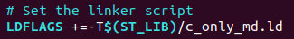
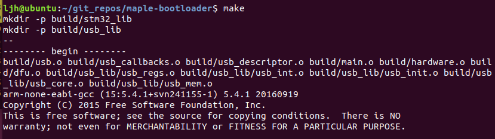
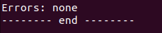
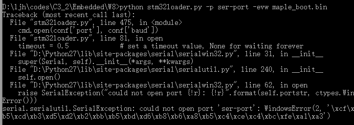
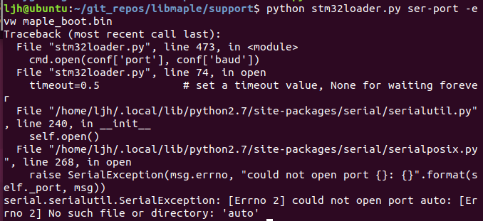
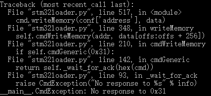
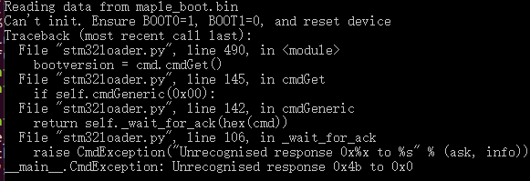
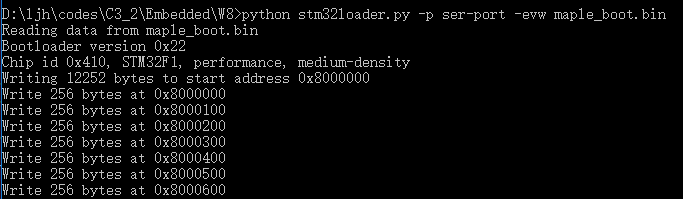
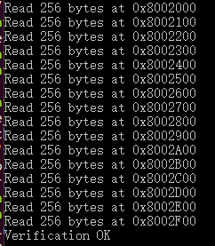

## Maple download toolchain

#### Step 1: Obtain a bootloader binary

First we get the source code of the maple-bootloader by

`git clone git://github.com/leaflabs/maple-bootloader.git`

For stm32f103, we need to modify the linker script. To find the linker script, we first check the **makefile** at the root directory.



And open **stm32_lib/c_only_md.ld**, change **128K** to **64K**.

```c
/* c_only_md.ld, Line 25-28 */
MEMORY
{
  RAM (xrw)     : ORIGIN = 0x20000000, LENGTH =  20K
  FLASH (rx)    : ORIGIN = 0x08000000, LENGTH =  64K   /* Changed from 128K */
}
```

Then use `make` to compile the project.



And it shows no error in the end.



#### Step 2: Connect the STM32 to your computer(Just like before)

- RXD -> TX (Pin A9)
- TXD -> RX (Pin A10)
- VCC -> 3.3V (Bottom Right one)
- GND -> GND (Upper Left one)
- BT0 -> 1, BT1 -> 0

#### Step 3: Reset the hardware by pressing the reset button(Just like before)

#### Step 4: Get the python loader

First install pyserial-3.4.0 to your python 2.7(2.5+) by `pip install pyserial`.

Then download **stm32loader.py** and modify `conf['port']` directly to my serial port.

```python
conf['port'] = "COM4" # Point to your serial port directly, instead of automatically searched
```

If we don't do this, we may encounter the runtime errors, which is due to the absense of desired serial port.

##### Some possible errors

Error on Windows 10, if the port is not opened successfully.



Error on Ubuntu 17.10, if the port is not opened successfully.



Error on Windows 10, if the port is not connected very well.



Error on Windows 10, if the BOOT pin is not set well.



##### Successfully loaded





Source: https://github.com/leaflabs/libmaple/raw/master/support/stm32loader.py

Reference: http://docs.leaflabs.com/static.leaflabs.com/pub/leaflabs/maple-docs/latest/bootloader.html