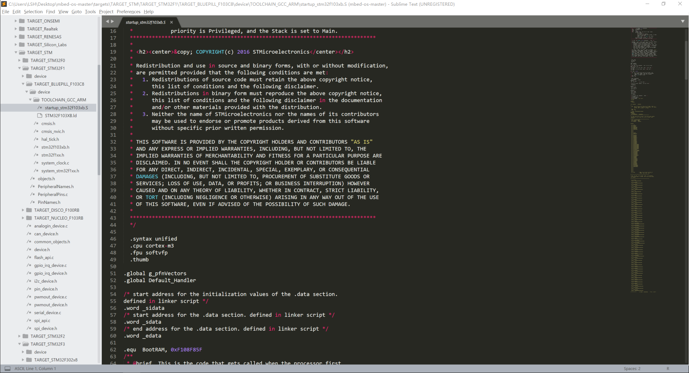
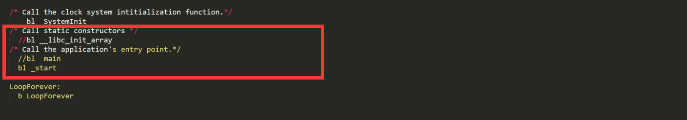
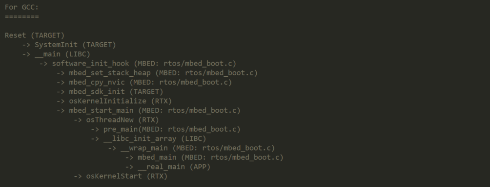
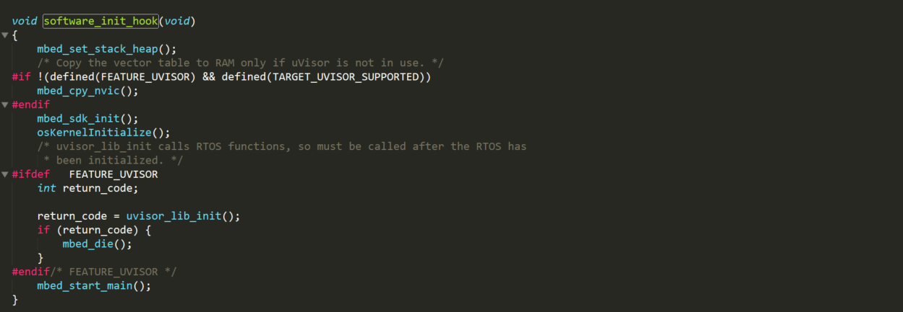
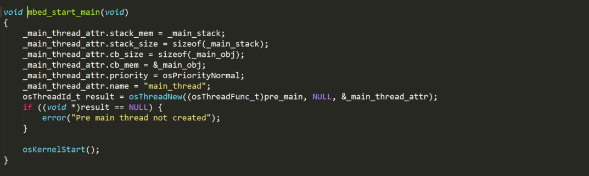
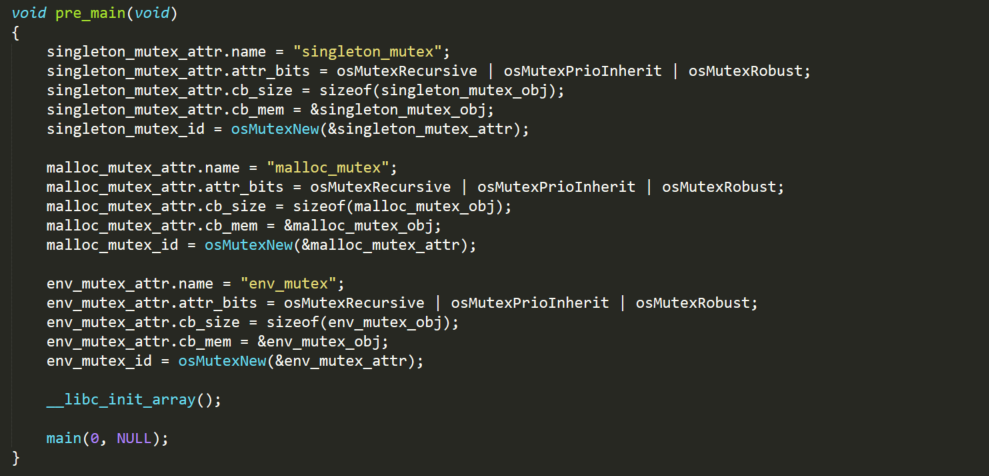
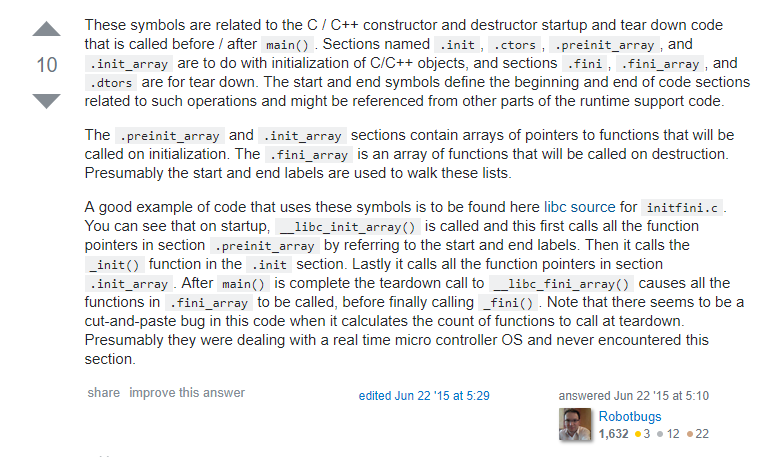
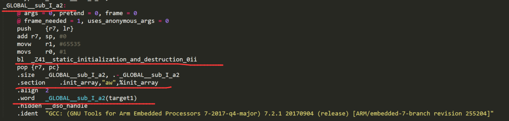
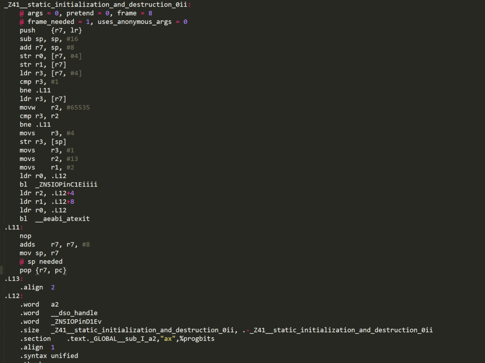
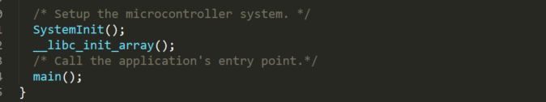

# MBED启动代码分析
>因为之前的代码全局对象无法做到初始化，所以研究mbed是怎么做的


在`github`上下载`mbed-os`的源码
在`targets/TARGET_STM/TARGET_STM32F1/TARGET_BLUEPILL_F103C8/device/TOOLCHAIN_GCC_ARM/`我们可以找到一个熟悉的文件`startup_stm32f103xb.S`（我是用startup关键字搜到这个文件的)



往下翻一翻，我们发现了我们的关注点。启动代码先调用了`SystemInit`（和我们的启动代码一样），然后调用了`_start` ,之后就进入了死循环。其实这个代码分析到此就可以结束了，因为我们要的答案已经写在注释里面了，启动代码在调用`main`之前先调用了`__libc_init_array`，这个函数的作用正如注释说的`call static constructors`。虽然这两个函数被注释了，取而代之的是`_start`，但是程序员的直觉告诉我们，这两个函数肯定会在`_start`里面被调用。接下来我们就带着答案去找下过程。



然而。。我们在源码中找不到`_start`的定义，Google了一把，这个函数是gcc标准库的函数，所以是找不到的。我们再用`startup`,`boot`关键字搜一下源码，又找到了一个似乎很靠谱的文件`mbed_boot.c`,在这个文件最上方的注释中，发现了这段话



很明显，这个就是mbed启动的过程，上电后进入Reset中断，然后`SystemInit`，然后调用`__main`, 对比之前的启动代码，这个`__main`就是那个`_start`了，括号里面还标着（LIBC）。然后`__main`里面有接着调用了`software_init_hook`,这个`software_init_hook`的定义是这样的



我们看到最后一行调用了`mbed_start_main`



从名字中我们可以推测出，这个函数是启动了一个主线程，设置堆栈参数，优先级，然后`osThreadNew`出一个线程，这个线程传入的函数指针是`pre_main`，`pre_main`的定义是根据编译器条件编译的，我们找到GCC版本的



前面一大堆看名字都是操作系统的互斥锁之类的，然后调用了我们之前就注意到的`__libc_init_array()`,然后是`main`，这个`main`就是我们写的main，从参数中可以看出`argc`,`argv`,那么没跑了，答案就是这个`__libc_init_array`，但是同样的我们找不到这个`__libc_init_array`的定义，因为他也是gcc的标准库函数。然后我去Google了一把`__libc_init_array`

https://stackoverflow.com/questions/15265295/understanding-the-libc-init-array



然后有一个`__libc_init_array`的例子实现

```c
   17 static void __libc_init_array() {
   18     size_t count, i;
   19     
   20     count = __preinit_array_end - __preinit_array_start;
   21     for (i = 0; i < count; i++)
   22         __preinit_array_start[i]();
   23     
   24     _init();
   25 
   26     count = __init_array_end - __init_array_start;
   27     for (i = 0; i < count; i++)
   28         __init_array_start[i]();
   29 }
```

大致的意思是说，这个函数会遍历`__preinit_array`段的函数指针，并调用，然后调用`_init`函数，然后遍历`__init_array`段的函数指针，并调用。然后这些`__init_array`里面的函数指针，指向的就是全局对象的构造函数。

接下来我们写个简单的代码，看看`__init__array`段到底是怎么样的

```c
#include "gpio.h"

IOPin a2(PORT_C,13,OUTPUT,PUSH_PULL);
int main(){
	a2.init();
	while(1){
		uint32_t i=655350;
		while(--i);
		if(a2.read_output()==LOW){
			a2.write(HIGH);
		}
		else{
			a2.write(LOW);
		}
	}
}
```

使用`--save-temps`编译选项，就可以保留编译的中间结果，查看`main.s`



在最下面，我们看到`.init_array`段，里面有一个地址`__GLOBAL__sub_I_a2`，这个地址对应的过程里面调用了`_Z41__static_initialization_and_destruction_0ii`,虽然不知道是干嘛的，但是这个名字告诉我们，应该是构造和析构函数



虽然看不懂什么意思，但是频频出现的`IOPin`和`a2`,应该就是和我们那个全局对象有很大关系的函数。

**总结一下就是，全局对象的构造函数，会被`.init_array`段的函数指针引用，然后`__libc_init_array`函数会调用`.init_array`段引用的函数，然后启动代码在调用`main`之前再调用`__libc_init_array`，就可以做到全局对象初始化**

最后我们再来验证一下，因为去掉操作系统的部分，我们和mbed启动的差别就在有无调用`__libc_init_array`，所以我在`startup.c`里面加了句`__libc_init_array()`



还是上面那段GPIO闪烁的代码，

